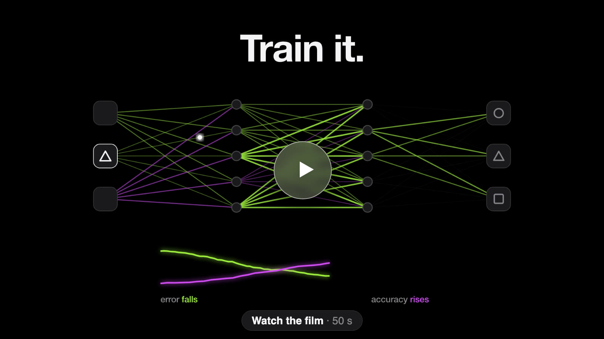
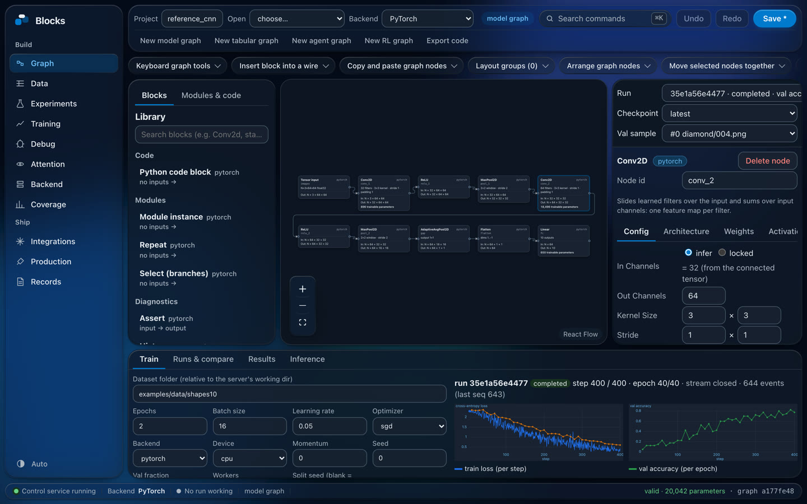
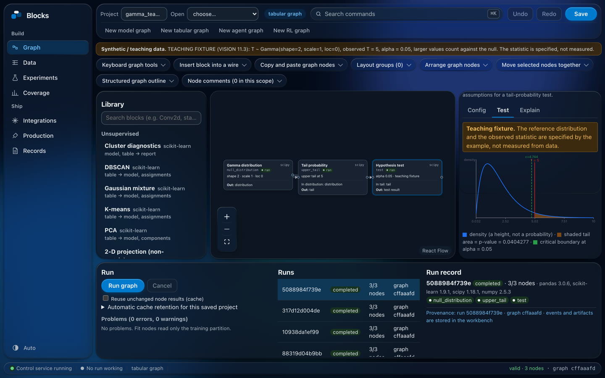
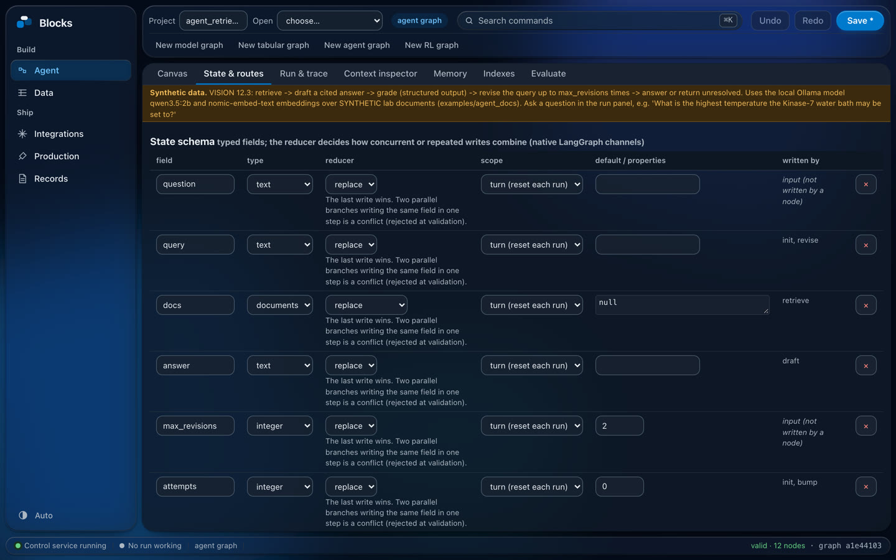
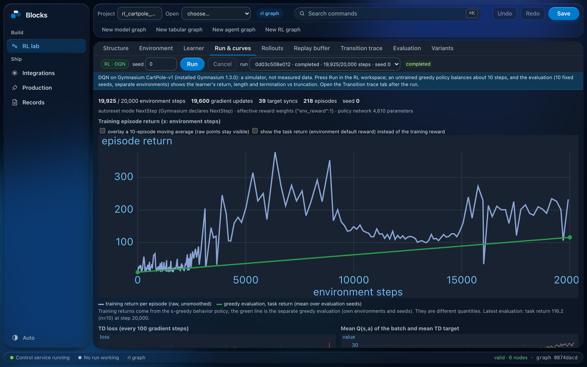

<p align="center">
  
</p>

<h1 align="center">Blocks</h1>

<p align="center">
<b>Build models, data pipelines, AI agents and reinforcement-learning experiments by connecting blocks.</b><br>
Run them on your own machine and see what every piece did. No glue code.
</p>

<p align="center">
  <a href="#watch-it"><b>Film</b></a>
  &nbsp;·&nbsp;
  <a href="#what-you-can-build"><b>What you can build</b></a>
  &nbsp;·&nbsp;
  <a href="#measured"><b>Measured</b></a>
  &nbsp;·&nbsp;
  <a href="#quick-start"><b>Quick start</b></a>
  &nbsp;·&nbsp;
  <a href="#how-it-works"><b>How it works</b></a>
  &nbsp;·&nbsp;
  <a href="#what-this-is-not"><b>What this is not</b></a>
  &nbsp;·&nbsp;
  <a href="docs/GUIDE.md"><b>Full guide</b></a>
</p>

---

Most machine-learning work starts as a diagram and then turns into hundreds of lines of wiring code.
**Blocks makes the diagram the program.** You pick blocks from a library of 118, connect them, and
the graph checks itself as you go: every wire shows the shape of the data on it, every block shows
its parameter count, and a mismatch turns the wire red *before* anything runs. Press Run and the
curves stream in live; every step, checkpoint and input is recorded so you can open any run later
and see exactly what each block did.

It is built for people who understand the ideas behind AI but don't want to live in boilerplate:
students, researchers, analysts and teachers. Everything runs locally; nothing is sent anywhere.

## Watch it

<p align="center">
  <a href="https://mazenddr.github.io/Blocks/"></a>
</p>

A 50-second film of what Blocks does, from building a graph to agents and reinforcement learning:
**[watch it on the project page](https://mazenddr.github.io/Blocks/)**, or
[play the video file directly](https://mazenddr.github.io/Blocks/blocks-film.mp4).

<table>
  <tr>
    <td width="50%"><br><sub><b>Build and train.</b> Shapes and parameters on every block; curves stream in while it trains.</sub></td>
    <td width="50%"><br><sub><b>Analyse.</b> Tables, classical ML and statistics, with the evidence drawn for you.</sub></td>
  </tr>
  <tr>
    <td width="50%"><br><sub><b>Agents.</b> Compiled to native LangGraph: typed state, routes, loops, approvals.</sub></td>
    <td width="50%"><br><sub><b>Reinforcement learning.</b> Gymnasium environments with every transition kept.</sub></td>
  </tr>
</table>

## What you can build

One canvas, five kinds of graph. Wires of different kinds never mean the same thing, so a tensor can't be
plugged into a table by accident. 37 example projects open from the editor's **Open** menu.

| Graph kind | What it's for | Runs on | Try the example |
|---|---|---|---|
| **Model** | Neural networks: layers, losses, modules you can reuse, Python code blocks | PyTorch, Keras 3, JAX | `reference_cnn`, `residual_cnn`, `transformer_sequence` |
| **Tabular** | Data preparation, classical ML, statistics tests, clustering and projections | pandas, scikit-learn, SciPy | `tabular_regression`, `gamma_teaching`, `unsupervised_cells` |
| **Agent** | AI agents with typed state, routes, bounded loops, memory, tools and approvals | LangGraph, a local model (Ollama) | `agent_retrieval_revision`, `agent_approval_tools` |
| **RL** | Environments, reward components, replay buffers, DQN and TD3 learners | Gymnasium | `rl_cartpole_dqn`, `rl_pendulum_td3` |
| **Vision · NLP · speech** | Typed domain workflows with recorded inspection | PyTorch | `nlp_token_classification` |

**Around the canvas**

- **Check before you run.** Shapes, types and parameter counts are computed as you edit; problems are shown on the block and the wire, with a suggested fix.
- **Run and inspect.** Live loss and accuracy, checkpoints, weights and activations, a debugger with captures and breakpoints, attention views, and run-to-run comparison.
- **Switch backends.** The same model graph runs on PyTorch, Keras 3 or JAX; a per-node compatibility report says what converts and what doesn't, before anything runs.
- **Get the code.** Export readable native source for each backend; every line points back to the block it came from.
- **Connect real data.** PostgreSQL (with a visual query builder), S3 and DVC sources; every run keeps a snapshot of exactly what it read.
- **Run experiments.** Grid and random sweeps with seeds and folds as separate dimensions, compared trial by trial.
- **Ship it.** A local model registry and serving with traffic and monitoring views, and searchable records of every run with notes and tags.
- **Edit fast.** Undo and redo, copy and paste, insert a block into a wire, layout groups, auto-arrange, an outline, comments, and a command search (⌘K / Ctrl K).

## Measured

**Graph-built models run like hand-written ones.** The reference CNN lowered from its graph, against the
same network written by hand in each framework, timed on CPU (Apple M4 Pro, batch 16, 3×64×64; median of
5 fresh processes × 50 timed calls). From [`benchmarks/results/m6a_summary.md`](benchmarks/results/m6a_summary.md).

| Train step (forward + backward + SGD) | Hand-written | From the graph | Ratio |
|---|---:|---:|---:|
| PyTorch | 17.41 ms | 17.30 ms | 0.994 |
| Keras 3 (TensorFlow) | 13.51 ms | 14.09 ms | 1.044 |
| JAX | 7.81 ms | 7.90 ms | 1.011 |

- **Tabular pipelines scale linearly** from 10 thousand to 10 million rows (CSV → split → standardize →
  logistic regression → metrics), about 3.8 µs per row on the Mac, with about 3 GiB peak memory at 10M rows
  ([`benchmarks/results/tabular_scale_summary.md`](benchmarks/results/tabular_scale_summary.md)).
- **Data-parallel training matches one process:** up to 8 workers on one machine, with a maximum parameter
  difference of 6.3e-8 (SGD) and 3.2e-5 (Adam).
- **Accessibility:** an automated audit of 27 workspace views finds 0 unnamed buttons, inputs or images in
  Chrome's accessibility tree.
- **Tested in CI on every pull request and every push to `master`:** 909 Python test functions, plus 23
  real-browser editor journeys and a full backup-and-restore journey ([`.github/workflows/verify.yml`](.github/workflows/verify.yml)).

## Quick start

You need Python 3.13+, Node.js and [pnpm](https://pnpm.io).

```bash
python3 -m venv .venv
.venv/bin/pip install -r python/requirements.txt
.venv/bin/pip install -e .
pnpm -C apps/editor install
```

Then run the control service and the editor in two terminals:

```bash
# 1 · the control service (http://127.0.0.1:8000)
source .venv/bin/activate
python examples/make_shapes10.py     # 200 small synthetic shape images for the CNN example
python -m uvicorn control.app:create_app --factory --app-dir services --host 127.0.0.1 --port 8000

# 2 · the editor (http://127.0.0.1:5173)
pnpm -C apps/editor dev
```

Open http://127.0.0.1:5173. The reference CNN loads as a draft: click a block to edit it, press **Run**
in the dock to train it, then open the Weights and Activations tabs. Use **Open** to switch to any of the
examples. Agent examples use a local [Ollama](https://ollama.com) server; the setup for every feature
(PostgreSQL, S3, trackers, GPU, containers) is in the **[full guide](docs/GUIDE.md)**.

```bash
pytest -q                                 # the Python test suite
pnpm -C apps/editor build                 # production build of the editor
```

## How it works

<p align="center">
  
</p>

A project is a typed graph saved as JSON. The control service validates it with the same rules the editor
shows, then runs it in worker processes that stream events back to the editor. Runs, events, checkpoints
and data snapshots live in `.workbench/` (SQLite records and content-addressed files), so any run can be
reopened, compared or restored later. Each design decision is written down as an
[architecture decision record](docs/adr/) (83 of them).

## What this is not

- **Not a cloud service.** It runs on your machine. There is an optional bearer token and named accounts
  for a local network, and a container image, but no hosted version.
- **Not every model on every backend.** Keras 3 and JAX run a portable subset of 14 operations, train with
  plain SGD only, and save PyTorch-format checkpoints. Everything else, and every unsupported setting, is
  reported per block before running; nothing is silently substituted.
- **Agents were tested live with a local Ollama server.** Other providers go through an
  OpenAI-compatible endpoint; an Anthropic adapter exists but its live test is skipped without a key.
- **Example data is labelled.** The examples use small synthetic or teaching datasets (marked SYNTHETIC
  in the app); the numbers above are about speed and correctness, not model quality.

The full list of what is and isn't provided, feature by feature, is in [`docs/CAPABILITIES.md`](docs/CAPABILITIES.md).

## Docs

| | |
|---|---|
| [Full guide](docs/GUIDE.md) | Setup and every feature with the exact commands, milestone by milestone |
| [Capabilities](docs/CAPABILITIES.md) | What is implemented and tested, and what is not, per feature |
| [Vision](docs/VISION.md) · [Plan](docs/PLAN.md) | Where the project is going and how it got here |
| [Coverage](docs/COVERAGE.md) | Every operation, per backend: tested, converted or unsupported |
| [Recovery](docs/RECOVERY.md) | Backing up and restoring a workbench |
| [Decision records](docs/adr/) | Why each part works the way it does |

## Licence

Code: [MIT](LICENSE). Libraries keep their own licences (PyTorch, TensorFlow/Keras, JAX, scikit-learn,
LangGraph, Gymnasium and the rest are pinned in [`python/requirements.txt`](python/requirements.txt) and
[`apps/editor/package.json`](apps/editor/package.json)). The example datasets are generated by the scripts in
[`examples/`](examples/) and are synthetic or small teaching fixtures.
