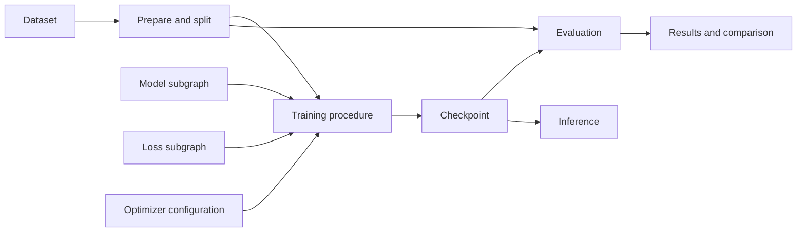
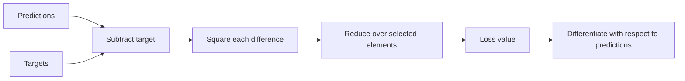
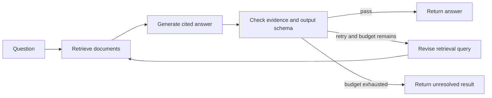
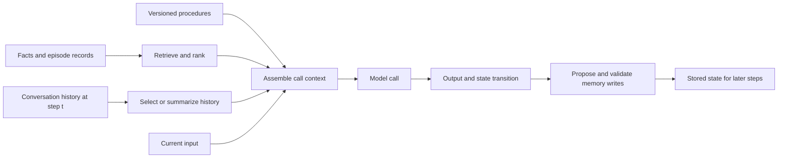
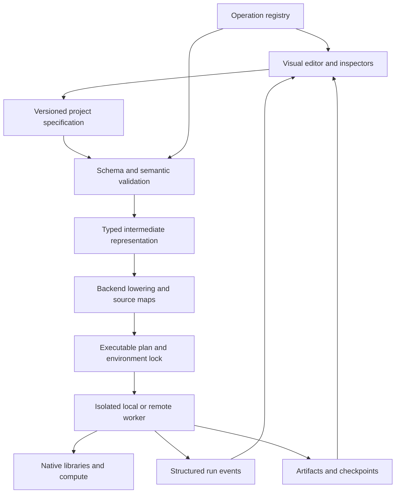
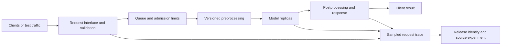

# Visual AI Workbench

**A complete visual scientific workbench: connect data, design experiments, build models, inspect computations, and evaluate production behavior.**

> A scientist should be able to express an idea as connected blocks, open any supported block to understand and change its internal computation, follow actual values through the experiment, and run the result without writing code.

**Document status:** Product vision and implementation specification. The name is a working title. All features, architectures, examples, and performance numbers below describe proposed behavior or acceptance targets, not software already implemented or benchmark results.

**Audience:** The AI engineering agent building this project, future maintainers, contributors, data scientists, analysts, AI/ML engineers, educators, and domain scientists such as biochemists who want to apply theory directly.

**Central requirement:** The blocks themselves are inspectable scientific instruments. A settings form alone is insufficient. Every supported block must provide a meaningful visual representation of its computation, editable composition where applicable, real input/output inspection, and an explanation tied to the selected experiment. The target is the depth and flexibility of code expressed through visual operations.

**Workspace requirement:** A scientist should be able to complete supported work inside this application: discover connected data, query it, version it, experiment, debug, compare, document, and prepare or operate a supported deployment. Visual programming is the default. An integrated code editor is available when the user deliberately wants code. External storage, compute, frameworks, and tracking systems can remain connected services managed through this workspace.

**Navigation:** [Vision](#1-the-vision) · [Block anatomy](#61-the-required-anatomy-of-an-explorable-block) · [Visual programming](#91-expressing-the-things-people-normally-write-in-code) · [Model library](#93-an-explorable-library-of-model-families) · [Loss functions](#101-loss-functions-as-editable-mathematics) · [Statistics](#111-statistics-and-hypothesis-testing-are-core-workflows) · [LLM memory](#124-memory-is-a-visible-subsystem) · [Debugger](#131-click-any-wire-to-inspect-the-value-crossing-it) · [Architecture](#15-architecture-compile-visual-intent-into-native-execution) · [Roadmap](#23-delivery-roadmap) · [Agent instructions](#26-instructions-for-the-building-ai-agent)

**Scientific workspace:** [Connections](#75-the-connections-and-data-explorer-workspace) · [Domain tools](#95-learning-paradigms-need-their-own-workflows) · [Reinforcement learning](#99-a-dedicated-reinforcement-learning-laboratory) · [Code inside blocks](#155-an-integrated-code-editor-for-optional-customization) · [Production](#175-production-is-an-inspectable-execution-mode) · [Experiment management](#191-an-experiment-workspace-with-tracking-built-in)

## 1. The vision

Create a visual development environment for the entire scientific experiment: data preparation, mathematical operations, statistical inference, model architecture, training, evaluation, inference, and language model workflows.

The experience should feel like assembling an understandable machine. Every block has a purpose. Every connection shows what moves between operations. Every important setting is accessible. The user can zoom out to understand the experiment and zoom in to inspect the mathematics, parameters, data, and execution inside it.

The interaction takes inspiration from node editors such as n8n. The subject matter is scientific and AI work: datasets, tensors, learned parameters, optimization, statistical evidence, environments, retrieval, and agent state. Integrated connections to databases, object storage, repositories, data-versioning systems, model providers, and compute are part of the product. Users should not have to prepare an import script or manually download data before they can begin.

The long-term ambition is to expose the power of PyTorch, TensorFlow, JAX, classical machine learning, scientific statistics, LangChain, and LangGraph through a coherent visual language. A user should be able to construct unusual architectures, losses, training procedures, hypothesis tests, memory policies, and agent workflows using composable operations. Ready-made models accelerate the start and remain open for inspection and modification.

The intended destination is a daily working environment that scientists can choose in place of separate notebooks, IDEs, data-import scripts, and disconnected experiment dashboards for supported scientific work. Users should bring knowledge of their domain and the theory they want to apply. The workbench should let them express that knowledge without first learning Python, another programming language, or framework-specific syntax. Users who choose to write code can do so inside a block with integrated execution and debugging.

The application removes the burden of programming syntax and repetitive plumbing. It also helps people learn the concepts they need to make sound scientific decisions. Knowing how to connect blocks still requires understanding what the experiment is trying to test.

### The product promise

**Give scientists the control of programming, the visibility of an interactive scientific instrument, and the ability to learn by inspecting a real computation—all through blocks.**

A new user should get a working experiment quickly. An expert should be able to open that same experiment and control its internals. Both must be working with the same executable project.

## 2. What success means

A successful user can:

1. Load a dataset and see its structure, quality, and provenance.
2. Remove duplicates, handle missing values, create splits, and inspect the consequences.
3. Build a model visually, including its layers and low-level operations.
4. See tensor dimensions, parameter counts, and data types before training.
5. Configure the loss, optimizer, training schedule, and evaluation procedure.
6. Run on available compute without managing a training script.
7. Investigate an error at the responsible node or connection.
8. Change a hypothesis, compare experiments, and recover previous results.
9. Build retrieval and stateful language model workflows in the same environment.
10. Share a reproducible project that another person can inspect and run.
11. Open a loss, optimizer, memory policy, or statistical test and inspect its internal calculation.
12. Create a new reusable operation by composing existing visual primitives.
13. Follow a selected observation, tensor element, token, or memory record through its available lineage.
14. Learn an unfamiliar operation by changing a small example and seeing both the mathematics and computed result.
15. Discover and query authorized data in connected storage without writing an extraction script.
16. Define a study, run controlled comparisons and ablations, and retain the evidence behind a conclusion.
17. Explore supervised, unsupervised, self-supervised, and reinforcement-learning workflows with suitable diagnostics.
18. Inspect vision, text, speech, and other supported scientific data in domain-appropriate views.
19. Add optional code inside the same workspace and connect it through typed block interfaces.
20. Test and inspect how a pinned model pipeline behaves under real or simulated production traffic.

Success has three separate dimensions:

| Dimension | What the user experiences | How we will measure it |
|---|---|---|
| Scientific control | Supported behavior is accessible without writing code | Capability coverage, completed research tasks, unsupported cases |
| Authoring speed | Ideas become valid experiments with little repetitive work | Time to first result, edit time, mistakes, recovery time |
| Execution speed | The UI adds little overhead to equivalent native execution | Matched runtime, throughput, memory, and startup benchmarks |

Do not claim universal framework coverage or universal speed superiority. Publish tested coverage and measured performance. Treat gaps as explicit engineering work.

## 3. Product principles

- **Depth through expansion.** Start with understandable blocks; allow users to open them into inspectable subgraphs.
- **No routine code escape.** Custom losses, predicates, loops, schedules, reducers, and memory policies should be authored with blocks. Requiring a Python snippet for an otherwise supported scientific task is a coverage gap.
- **A visual form for every operation.** A layer, distribution, optimizer, and memory store each need a representation suited to their actual structure and behavior.
- **The graph is the program.** Connections and settings determine execution. The canvas cannot be a decorative picture disconnected from runtime behavior.
- **Native execution.** Use the actual supported libraries and their kernels rather than rebuilding their numerical engines in the browser.
- **Visible meaning.** Explain what an option changes, its valid values, and its impact on shape, state, computation, or interpretation.
- **Honest visualization.** Distinguish measured values, estimates, samples, and teaching illustrations.
- **Fast expert workflows.** Keyboard navigation, search, duplication, reusable modules, and bulk editing matter as much as dragging blocks.
- **Reproducibility by default.** Every run records the graph, data references, environment, settings, and artifacts needed to investigate it.
- **Local ownership.** A scientist should be able to use the core product with local data and compute, without a mandatory cloud account.
- **Extensibility.** Contributors can add operations and visualizations without rewriting the editor.
- **Progressive coverage.** Each supported feature works end to end; unfinished capabilities are labeled clearly.
- **Scientific inquiry drives the workflow.** Connect each experiment to a question, comparison, method, evidence, and conclusion.
- **Data arrives through the workspace.** Discovery, credentials, queries, transfer, caching, and version selection are visible product features.
- **Optional code stays integrated.** A scientist never needs a separate IDE merely to customize a block they choose to code.
- **One traceable lifecycle.** Connect source data, graph revision, run, artifacts, evaluation, release, and production observations through persistent identities.

## 4. A visual language with several levels

One canvas cannot communicate every detail at once. Provide a hierarchy of related views with stable navigation and shared selections.

| Level | Example | What is editable |
|---|---|---|
| Experiment | Data → training → evaluation | Data versions, execution dependencies, run configuration |
| Data pipeline | Deduplicate → split → fit transforms | Columns, rules, partitions, learned preprocessing |
| Model architecture | Convolution → activation → pooling | Layers, connections, parameter sharing, dimensions |
| Mathematical operations | Multiply → reduce → add | Tensor operations, axes, broadcasting, constants |
| Training procedure | Forward → loss → gradients → update | Optimization, accumulation, schedules, control flow |
| Agent workflow | Retrieve → generate → check → route | Typed state, branches, tools, persistence, termination |
| RL interaction | Observe → act → step → learn | Environment dynamics, policies, rewards, buffers, evaluation |
| Experiment study | Baseline → variants → evidence | Hypotheses, sweeps, repeats, comparisons, research notes |
| Production | Request → preprocessing → inference → response | Release identity, traffic, resources, traces, monitoring |

Selecting a training block opens its training graph. Selecting the model inside that graph opens its architecture. Selecting a custom loss opens its mathematical expression graph. Breadcrumbs and a minimap keep the user oriented.

A reusable block may contain a subgraph. Editing a shared definition and editing one instance must be separate actions. Offer explicit **share parameters**, **copy parameters**, and **initialize independently** choices when models are reused.

### Different graph semantics must remain explicit

- Data pipelines often follow directed dependencies.
- A model describes tensor computations and may include structured control flow.
- A training procedure mutates model and optimizer state across iterations.
- An agent workflow may cycle, pause, resume, and update shared state.

Use a shared editor foundation, with graph types that enforce their own execution rules. A tensor wire and a control-flow transition must not mean the same thing.

### Learning, building, and debugging are views of the same object

A user should be able to select one operation and move continuously between its scientific explanation, editable internal graph, live or captured values, and execution history. Do not build a separate educational animation that has no connection to the executable block.

Use four coordinated depths: **overview**, **structure**, **calculation**, and **execution**. For a convolution these mean its layer card, channel/kernel structure, multiply-and-reduce equation, and captured values. For a hypothesis test they mean its result, assumptions and statistic graph, tail-probability calculation, and sampled/null-distribution data. For an agent memory block they mean its role, read/write policy, selected records, and state changes across events.

Users choose how far to expand. Full detail should be reachable on demand without forcing thousands of operations onto the canvas at once.



## 5. The workspace experience

### 5.1 Main layout

Provide workspace destinations for **Projects**, **Data and connections**, **Build**, **Experiments**, **Environments**, **Debug**, **Registry**, **Production**, and **Learn**. These share the same project identity, artifact browser, permissions, and navigation history. The canvas below is the Build view; experiment tables, source catalogs, and serving dashboards need layouts suited to their tasks.

```text
┌ Project / revision ─ Backend ─ Compute ─ Validate ─ Run ─ Stop ┐
│                                                              │
│ Library          Experiment canvas             Inspector     │
│ ───────────      ────────────────────────      ─────────────  │
│ Search blocks    [Image dataset]               Conv2D        │
│ Data                    │                      Filters: 32   │
│ Transforms       [Split and prepare]           Kernel: 3×3   │
│ Tensor ops              │                      Stride: 1     │
│ Layers           [CNN architecture]            Padding: 1    │
│ Training                │                      Bias: yes     │
│ Evaluation       [Train] → [Evaluate]          Params: 896   │
│ LLM / agents                                   Output shape  │
│ My modules                                     Help / source │
│                                                              │
│ Data preview | Model view | Run metrics | Debugger | Artifacts│
└──────────────────────────────────────────────────────────────┘
```

This is a behavioral wireframe, not a prescribed visual theme. Prioritize readable typography, consistent spacing, legible connections, and restrained use of motion.

### 5.2 Block library

Search by scientific intent, common terminology, and framework API name. Searching “remove duplicates” should find deduplication; searching `Conv2d` should find the corresponding layer.

Every result shows its purpose, accepted inputs, produced outputs, backend support, and maturity. A block incompatible with the selected backend can remain discoverable, but its limitation must be visible before insertion.

Support favorites, recent blocks, project modules, and curated examples. Suggest compatible next blocks from the selected output's type. Do not automatically change the experiment to make a suggestion fit.

### 5.3 Canvas behavior

Required interactions include pan, zoom, multi-select, undo/redo, copy/paste, duplicate, align, auto-layout, search, groups, comments, and reusable subgraphs. Support insertion into an existing connection and moving a sequence of nodes as one unit.

At a distance, show module names and critical summaries. At closer zoom, show port types, shapes, and key settings. Open detailed controls in the inspector instead of rendering hundreds of form fields on the canvas.

Provide keyboard creation and connection, a searchable command menu, and a structured outline alternative to dragging. Encode connection type with labels or patterns as well as color. Respect reduced-motion settings and support accessible contrast.

Large projects need collapsed groups, navigation to errors, references to shared modules, and stable layouts. Automatic layout must not constantly rearrange the user's work.

### 5.4 Inspector

Use consistent tabs: **Overview**, **Structure**, **Equation or algorithm**, **Inputs and outputs**, **Parameters and state**, **Execution**, **Explore**, and **Reference**. Settings are available beside the view they affect. Implementation source remains an optional reference view.

Common options appear first. Advanced options stay accessible and searchable. Resolved defaults are visible and saved with the graph so a library upgrade cannot silently change an old experiment.

Each field should provide an ordinary-language explanation, accepted values, dependencies on other settings, and a useful example. Controls can include numeric inputs, sliders, distributions, column selectors, tensor-axis selectors, and visual expression builders.

### 5.5 Edit behavior during a run

A run executes an immutable graph revision. Editing the canvas creates a draft revision. The UI clearly distinguishes the running revision from the draft and offers “run new revision” or “resume compatible checkpoint.” Never silently mutate a model already being trained.

## 6. What every block must contain

Each block definition needs more than a code snippet. It is a versioned contract between the editor, validator, compiler, runtime, and documentation.

| Contract element | Required information |
|---|---|
| Identity | Stable type identifier, version, category, display name |
| Purpose | Short explanation and a small example |
| Input/output ports | Types, shapes or schemas, cardinality, optionality |
| Settings | Types, ranges, defaults, conditional fields, serialization |
| Constraints | Shape, dtype, device, layout, state, and backend requirements |
| State | Parameters, buffers, fitted statistics, mutable state, ownership |
| Behavior | Pure transform, stateful operation, random operation, external effect |
| Backend implementation | Native API mapping, package constraints, supported modes |
| Visualization | Compact summary, inspector views, supported runtime probes |
| Execution | Initialization, execution, cancellation and checkpoint support |
| Provenance | Versioned implementation and source mapping |
| Quality | Reference tests, examples, documentation, maturity status |

Port families should include tables, dataset partitions, image batches, tensors, scalar values, fitted transformers, estimators, parameter sets, checkpoints, documents, messages, tool results, typed workflow state, memory records, probability distributions, hypotheses, test statistics, and test results. Add typed connections/source snapshots, audio/time-aligned data, environment handles, observation/action spaces, transitions, rollout buffers, and serving requests/responses. Keep a distribution object distinct from samples, density values, and tail probabilities.

Distinguish configuration, data, trainable parameters, state updates, and control transitions. Some values are known at design time; others are known only during execution. Display unknown dimensions symbolically rather than inventing numbers.

An incompatible wire should explain the mismatch. Example: “This layer expects 32 channels, but this output has 64.” Offer concrete compatible edits, with a preview of the resulting changes.

### 6.1 The required anatomy of an explorable block

Every supported block must answer the following questions through its own interface:

| Surface | Question answered | Concrete interaction |
|---|---|---|
| Purpose | What does this operation mean? | Read a short explanation and inspect a tiny example |
| Structure | What is inside it? | Expand layers, stages, branches, gates, records, or a mathematical expression |
| Equation/algorithm | What exactly is computed? | Select a term and highlight its input, intermediate result, and reduction |
| Input | What is entering right now or at this recorded step? | Select sample, batch, feature, channel, token, field, or event |
| Configuration | What choices control its behavior? | Edit all supported arguments, dependencies, and advanced policies |
| Parameters/state | What was learned, accumulated, or stored? | Inspect values, shapes, versions, ownership, and before/after changes |
| Output | What did this operation produce? | View an appropriate plot/table/tensor/record and follow it downstream |
| Execution | What happened when it ran? | Inspect timing, order, route, gradient availability, and captured events |
| Exploration | What changes if I change this? | Fork a bounded sandbox example and compare results |
| Validity | Under which conditions is this meaningful? | Inspect assumptions, domain constraints, approximation, and limitations |

Selecting a symbol in an equation must select its corresponding port or internal node. Selecting a plotted value should reveal its source when that correspondence exists. Display units, axis names, reduction axes, and aggregation choices. A chart without those details is incomplete.

### 6.2 Match the visual representation to the operation

| Block family | Required representation |
|---|---|
| Dense layer | Input/output vectors, weight matrix, bias, selected weighted sum |
| Convolution | Channel stacks, kernel slices, receptive-field illustration, activation maps |
| Pooling | Selected spatial window, retained/reduced values, output location |
| Activation | Function curve, selected input/output, derivative where defined |
| Normalization | Selected axes, computed statistics, affine parameters, train/eval state |
| Attention | Selected head, Q/K/V projections, mask, scores, normalized weights, output |
| Recurrent unit | Time-indexed state, gates, transitions, sequence position |
| Tree | Split rules, chosen sample path, node counts, leaf output |
| Ensemble | Constituent predictions and their combination rule |
| Loss | Per-element/sample terms, weighting, masking, reduction, gradients |
| Optimizer | Selected parameter, gradient, state buffers, update equation, next value |
| Distribution/test | Domain, density/mass, cumulative/tail area, statistic, assumptions |
| Memory | Records or messages, scope, order, read/write policy, selected context |
| Data transform | Before/after values, affected rows, rule, fitted state, lineage |

These are design requirements for the corresponding implemented family. A generic JSON dump may accompany the visualizer but does not fulfill it. Representations can be two-dimensional, tabular, temporal, or spatial; use three-dimensional graphics only when they clarify the structure.

### 6.3 What can be expanded and edited

Composite blocks must open into their constituent operations and support creating an editable local variant. A visual function should expose named inputs, outputs, configurable arguments, and reusable definitions. Users can replace internal branches, insert operations, change a reduction, expose a previously internal setting, or package their result as a new block.

Primitive blocks terminate expansion at a meaningful mathematical or runtime operation. They still expose their contract, equation/algorithm, input/output inspection, and numerical options. Native kernels do not need to be drawn as machine instructions.

A fused implementation may not materialize the intermediates shown in its mathematical decomposition. Mark a value as **captured**, **recomputed for inspection**, **analytically derived**, **illustrative**, or **unavailable**. Recomputed values may differ numerically; do not present them as values captured from the original fused run.

Changing an internal formula creates a semantic revision. Do not leave the old optimized implementation attached to a modified equation. Recompile the changed graph or reject the unsupported change with an explicit explanation.

### 6.4 A complete visual operation has more than argument coverage

For each operation, separately track **configuration coverage**, **composition depth**, **visual explanation**, **runtime inspection**, **state/gradient inspection**, and **backend execution**. A block can support execution while still having incomplete visualization; expose that distinction in its maturity status.

Do not call an operation fully supported merely because every constructor argument has a form field. It must also let the scientist understand and investigate the behavior those settings produce.

## 7. Data preparation as an inspectable experiment

### 7.1 Sources and profiling

The first local fixtures use CSV/Parquet tables and image folders with labels. The product's source catalog also includes connected databases, object stores, repositories, and versioned dataset packages. Add JSON/JSONL, text corpora, audio, video, scientific arrays, and streaming sources through tested adapters. Local fixtures are an implementation starting point, not the full intended data experience.

Loading data should reveal schema, row/sample counts, types, missing values, invalid values, label distribution, duplicate candidates, and a bounded preview. State whether a profile is exact or sampled. Large datasets must stream or use paginated access rather than being copied into browser memory.

Keep the original source immutable. Cleaning produces derived artifacts and a transformation history.

### 7.2 Transformation catalog

| Family | Examples of visual controls | Useful visualization |
|---|---|---|
| Duplicate handling | Key columns, exact matching, similarity threshold, keep policy | Duplicate groups, retained record, affected counts |
| Missing values | Drop, constant, train-fitted imputation, missingness indicator | Before/after distribution and affected rows |
| Types and validity | Parse, cast, ranges, allowed categories, date rules | Invalid examples and conversion failures |
| Selection | Columns, rows, visual predicates, target and feature assignment | Selected/excluded counts and sample rows |
| Scaling and encoding | Standardization, normalization, categorical encoding | Fitted statistics and transformed examples |
| Feature construction | Arithmetic, interactions, dates, bins, text features | Expression graph, lineage, output distribution |
| Splitting | Random, stratified, grouped, temporal, predefined | Partition sizes, group overlap, time ranges |
| Images | Resize, crop, normalize, augmentation | Original/transformed pairs with seed |
| Text | Tokenize, chunk, filter, normalize | Tokens, chunk boundaries, document provenance |
| Sampling | Balanced sampling, weighting, bootstrap | Effective class distribution and sampling rule |

### 7.3 Scientific correctness must be visible

Train-fitted preprocessing must learn statistics only from the appropriate training partition. Validation and test data use those fitted transformations. In cross-validation, fitting repeats inside each training fold. These rules follow the leakage precautions documented by [scikit-learn](https://scikit-learn.org/stable/common_pitfalls.html).

Represent this distinction explicitly with **Fit transform** and **Apply fitted transform** semantics, even when a template presents a collapsed pipeline.

Duplicate handling needs its own policy. Duplicate and related samples should not accidentally span partitions. Allow a documented, fixed identity rule to establish duplicate groups before splitting; retain group lineage. Do not infer cleaning thresholds from held-out outcomes. Near-duplicate detection must expose its method and uncertainty, and conflicting labels need review rather than arbitrary deletion.

Augmented versions of a training image inherit its partition. They cannot become independent validation examples. For time series, show the time boundary and ensure derived features use only information available at prediction time.

The UI should distinguish deterministic validation errors from scientific warnings. For example, “test partition connected to preprocessing fit” can be blocked by the default policy; an unusual but valid distribution deserves explanation and a recorded decision.

### 7.4 Preview contract

Every transformation shows the rule, a bounded before/after sample, counts or count estimates, and downstream artifacts invalidated by a change. Previews must not overwrite data, advance training state, or trigger paid model calls without an explicit run action.

### 7.5 The connections and data explorer workspace

The Data workspace is a first-class entry point. A user connects an authorized source, browses its available data, previews a bounded sample, selects or builds a query, and adds a versioned source block to the experiment. Data transfer and preparation happen through the application.

Show a catalog with connection type, owner/scope, health, authorization status, available capabilities, and accessible resources. “All databases” means all supported sources the user has connected and is authorized to browse; the product cannot discover or grant access to unrelated infrastructure.

Provide connector-specific setup forms, credential references, a test-connection action, and actionable diagnostics for authentication, network, schema, or permission failures. For private networks, support a worker/connector agent deployed in that network so data need not pass through a public browser service.

### 7.6 Connector families and the expected experience

The following is the target catalog. Support is certified per connector/version, not inferred from the presence of a logo.

| Source family | Representative targets | What the scientist can do inside the workbench |
|---|---|---|
| Relational databases | PostgreSQL, MySQL/MariaDB, SQL Server, SQLite | Browse catalogs/schemas/tables, inspect types, build joins/filters, run bounded queries |
| Analytical warehouses | BigQuery, Snowflake, Redshift, supported Databricks endpoints | Select compute/catalog, inspect query estimates when exposed, create reproducible extracts |
| Object storage | S3 and tested compatible stores, Google Cloud Storage, Azure Blob | Browse authorized buckets/containers/prefixes, select partitions, inspect formats and versions |
| Local/shared files | Local folders, supported network mounts, HTTPS, SSH/SFTP | Browse, sample, stream or stage data through a worker, record file identity |
| Versioned research data | DVC repositories and remotes, supported dataset/artifact registries | Choose dataset path and revision, resolve actual data, retain provenance |
| Source repositories | GitHub, GitLab, and generic authorized Git remotes | Browse a pinned tree, import data/configs or explicitly wrap compatible code |
| Document/search/vector stores | Tested document databases, search services, and vector databases | Browse collections/indexes, apply typed queries, inspect retrieval results and score semantics |
| Scientific formats/catalogs | Supported HDF5, Zarr, NetCDF, imaging, sequence, and laboratory-data adapters | Inspect dimensions, units, metadata, chunks, and domain-specific records |
| Event/stream sources | Supported queues, logs, and time-series services | Select bounded windows, watermark/checkpoint policy, and schema evolution behavior |
| Model/experiment registries | Supported MLflow, W&B, and model-hub integrations | Select immutable versions, inspect metadata, resolve artifacts without manual downloads |

A connector must declare whether it supports discovery, sampling, filtering/projection pushdown, streaming, version/snapshot reads, incremental reads, writes, cancellation, and private-network execution. The source browser must reflect those capabilities.

The default data-retrieval path uses read permissions. Destination/write blocks are separate, visibly effectful operations with an explicit target and conflict policy.

### 7.7 SQL without requiring SQL, with SQL available when wanted

Provide a graphical query builder for table selection, column projection, joins, filters, aggregation, sorting, windows, and parameters as supported. Show join cardinality, possible row multiplication, missing keys, and resulting schema. Query construction should work without typing SQL.

Also provide an integrated SQL editor with schema-aware completion, syntax diagnostics, parameter binding, result preview, execution timing, query history, and source-specific explain/cost information when available. Preserve SQL dialect and timezone/decimal semantics.

The visual query and generated SQL should agree for the supported query subset. If a user writes SQL outside that subset, preserve it as an inspectable SQL block with typed outputs; do not pretend to round-trip arbitrary SQL into visual controls.

Run previews with bounded rows/time and source-enforced limits where possible. Validate destination permissions and classify side effects; a statement beginning with a particular keyword is not a sufficient read-only security check. Values use parameter binding, and identifier selection follows the connector's supported mechanism.

Cross-source joins should show where execution happens and whether data will move. A pushdown plan can accelerate a query but cannot silently change null, collation, precision, or ordering semantics.

### 7.8 S3, database snapshots, and DVC as reproducible sources

Selecting an S3 prefix should reveal objects, formats, partition structure, sizes, and available versions. Offer streaming or managed staging, filtered reads where supported, progress, resumability, and cache reuse. Pin explicit object-version identities when versioning is available; S3 versioning retains distinct object versions. Reference: [Amazon S3 versioning](https://docs.aws.amazon.com/AmazonS3/latest/userguide/Versioning.html).

A mutable path or repeated SQL query is not an immutable dataset. Record query text/parameters, source identity, extraction time, schema, and supported snapshot/version tokens. If the source cannot reproduce a snapshot, materialize a versioned extract when permitted and label the reproducibility limit. Hashes verify identity but do not preserve deleted source data by themselves.

For DVC, the user chooses a repository, revision, dataset path, and authorized remote. Resolve a branch/tag to a commit, retain the relevant DVC metadata or lock identity, and materialize/stream the referenced content through the worker. DVC metadata files are pointers and provenance, not the full dataset. References: [DVC file metadata](https://doc.dvc.org/user-guide/project-structure/dvc-files) and [DVC import](https://doc.dvc.org/command-reference/import).

An upstream update becomes a new source revision with a diff and rerun option. Never silently replace a dataset underneath a running experiment or refresh its identity while retaining old results.

### 7.9 Repositories and custom assets

Browse repository content at a pinned commit before importing it. Distinguish a dataset, configuration, pretrained model, reusable block package, and arbitrary source-code project. Handle large-file pointers and submodules explicitly where supported.

Code import must select an entry point, dependency environment, input/output contract, and execution capabilities. The workbench can wrap compatible functions/modules as blocks; it cannot automatically infer the full meaning of every repository. Importing or browsing a repository must not run its installation scripts.

Record the repository URL, commit, imported paths, checksums, license metadata, dependencies, and any local modifications. The scientist should be able to update a pinned dependency deliberately, compare changes, and roll back through the workspace.

### 7.10 A complete connected-data journey

Example: a researcher selects assay measurements from PostgreSQL and image assets from S3, then joins them using specimen identifiers. The workbench previews missing links and duplicate IDs, keeps the experimental unit visible, creates a source snapshot/manifest, and adds the resulting typed dataset to a project. The researcher chooses split rules and starts an experiment without writing an extraction script or manually downloading files.

The resulting run links back to the query, source versions, selected object set, transformation graph, and split definition. Connection failures preserve the project and identify the failing resource. Revoked access is reported distinctly from missing data or invalid schemas.

Preserve a live connection for future retrieval and an immutable source identity for each experiment. Expose transfer size, read volume, cache state, and cost estimates when available so moving data is an informed part of execution.

## 8. The flagship experience: building and understanding a CNN

This is the most important visual demonstration of the product. A convolution block must expose its actual architecture, not merely a label saying “CNN.”

### 8.1 Example architecture

Use a ten-class image classifier with RGB inputs resized to 64 × 64. The following is an illustrative architecture, with calculated dimensions and parameter counts; it makes no claim about classification accuracy.

`N` is batch size. The example uses PyTorch's logical `NCHW` convention: batch, channels, height, width.


| Operation | Selected configuration | Output shape | Trainable parameters |
|---|---|---|---:|
| Image input | RGB, 64 × 64 | `[N, 3, 64, 64]` | 0 |
| Convolution 1 | 3 → 32 channels, kernel 3, stride 1, padding 1, bias | `[N, 32, 64, 64]` | 896 |
| ReLU | Elementwise | `[N, 32, 64, 64]` | 0 |
| Max pooling | Kernel 2, stride 2, padding 0 | `[N, 32, 32, 32]` | 0 |
| Convolution 2 | 32 → 64 channels, kernel 3, stride 1, padding 1, bias | `[N, 64, 32, 32]` | 18,496 |
| ReLU | Elementwise | `[N, 64, 32, 32]` | 0 |
| Max pooling | Kernel 2, stride 2, padding 0 | `[N, 64, 16, 16]` | 0 |
| Global average pooling | Reduce each spatial map to 1 × 1 | `[N, 64, 1, 1]` | 0 |
| Flatten | Preserve batch axis | `[N, 64]` | 0 |
| Linear | 64 inputs, 10 outputs, bias | `[N, 10]` | 650 |
| **Total** | | | **20,042** |

### 8.2 Convolution controls

The layer inspector exposes input channels, output channels/filter count, kernel dimensions, stride, padding, dilation, groups, bias, supported data type, and device placement. The adapter must preserve the selected backend's exact constraints. PyTorch and Keras have different APIs and conventions; their official references define the mappings: [PyTorch Conv2d](https://docs.pytorch.org/docs/2.14/generated/torch.nn.Conv2d.html) and [Keras Conv2D](https://keras.io/api/layers/convolution_layers/convolution2d/).

The surrounding model controls also expose initialization, parameter freezing, parameter sharing, and optional regularization. Keep these identifiable as model/parameter policies rather than pretending they are all arguments to the same native layer constructor.

### 8.3 What the scientist sees

The compact first-layer card should show:

```text
Conv2D                                      PyTorch
32 filters · 3×3 kernel · stride 1 · padding 1
Input:  N × 3 × 64 × 64
Output: N × 32 × 64 × 64
896 trainable parameters
[Architecture] [Weights] [Activations] [Gradients]
```

Selecting **Architecture** opens a channel-stack view. The user can see all 32 output channels, expand one filter, and inspect its three input-channel kernel slices. The visualization must make the distinction between a learned filter and the feature map produced for a particular input clear.

Selecting **Weights** shows actual learned values from a chosen checkpoint. Selecting **Activations** shows outputs for a named sample at a named layer and execution point. Selecting **Gradients** shows sampled gradient information from a captured training step.

Every numerical visualization carries its source: run, graph revision, checkpoint/step, sample, node, and normalization used for display. Before execution, label diagrams as schematic. Never fill empty inspectors with simulated “learned” values presented as results.

For deeper layers, use per-channel slices, grids, or clearly labeled projections. Do not imply that a many-channel learned filter is naturally an RGB photograph. Show actual value ranges and allow comparison with a shared color scale.

### 8.4 Interactive teaching mode

Allow a small illustrative convolution to advance one position at a time. Show the input patch, selected weight slices, elementwise products, channel reduction, bias, and output value. Changing stride, padding, or dilation updates the illustration.

This teaching view is explicitly separate from full-speed execution. It may operate on a tiny example and should never require animating every operation of a real training run.

For this example, the first layer has `32 × (3 × 3 × 3 + 1) = 896` parameters. The second has `64 × (32 × 3 × 3 + 1) = 18,496`. The final linear layer has `10 × (64 + 1) = 650`.

### 8.5 Editing has visible consequences

When the user changes the first layer from 32 to 64 filters:

1. Update that layer's output shape and parameter count immediately.
2. Identify the next layer's input-channel dependency.
3. Preview propagated changes when the downstream field is inferred; preserve a user-locked field and flag the mismatch.
4. Update model totals and resource estimates.
5. Mark incompatible checkpoints and downstream results as belonging to the old architecture.
6. Offer a new run or an explicitly defined partial-weight transfer; never silently reshape learned weights.

When the user attaches two incompatible residual branches, explain which dimensions disagree and offer an explicit projection or other compatible edit. A suggested fix must not silently alter the scientific hypothesis.

### 8.6 Training and interpretation

Connect the model to a loss and training procedure. For the example's integer class labels, use a compatible classification loss with the required target type. Keep the logits-versus-probabilities contract visible; a probability display can be a separate inference branch.

Show loss, validation metrics, class-level results, a confusion matrix, and inspectable mistakes. Add sampled activation distributions and gradient norms. More expensive interpretation tools, such as saliency views, should be optional and identify the method used; a heatmap is evidence from that method, not proof of the model's reasoning.

## 9. Beyond ready-made neural network layers

The long-term model editor must support both familiar building blocks and the ability to construct new ones visually.

| Capability family | Required direction |
|---|---|
| Tensor creation | Constants, shapes, ranges, random tensors, parameter initialization |
| Tensor manipulation | Reshape, transpose, slicing, indexing, gather/scatter, concatenation, split, padding |
| Mathematics | Arithmetic, matrix multiplication, reductions, comparisons, broadcasting, selected linear algebra |
| Neural layers | Dense, convolutions, pooling, embeddings, normalization, dropout, recurrent units, attention |
| Architecture composition | Residuals, multiple inputs/outputs, shared encoders, repeated modules, ensembles |
| Differentiation | Gradient computation, stop-gradient, higher-order derivatives where supported |
| Control flow | Conditions, loops, scans, mapped computation, explicit state |
| Loss construction | Tensor expressions, multiple objectives, reductions, weights, masks |
| Advanced research | Custom gradient rules, sparse/complex tensors, specialized operators, distributed execution |

All entries are scope targets. Each needs a published implementation status per backend.

A custom loss should be possible through a visual expression tree with named arguments and a live shape/type view. A custom module should be possible by selecting nodes and exposing chosen inputs and settings as its public interface.

Arbitrary new native kernels and arbitrary external Python behavior cannot be promised as automatically expressible through existing blocks. New capabilities enter through the plugin interface, then become reusable visual operations. The scientist using those operations should not have to write their implementation.

### 9.1 Expressing the things people normally write in code

The visual language needs the building blocks of computation as well as model layers. These capabilities let users express new combinations instead of waiting for someone to create a complete template.

| What an expert normally writes | Required visual equivalent |
|---|---|
| A literal or configuration value | Typed constant with scalar/vector/matrix/record editors |
| An arithmetic expression | Composable operators and an equation editor that builds the same typed graph |
| A predicate | Comparisons, Boolean logic, ranges, missing-value conditions, inspectable truth values |
| A function | Reusable subgraph with named arguments, return values, local scope, and an editable interface |
| A function passed into another operation | Typed function/subgraph port for losses, reducers, schedules, and transforms |
| A conditional | Branch predicate, branch bodies, and compatible result/state contracts |
| A loop | Iterable or stop condition, iteration state, body graph, limits, and output collection |
| Map/reduce/scan | Selected axis/collection, mapped function, aggregation, and state progression |
| A structured value | Typed lists, dictionaries/records, optional values, and field access |
| Indexing and broadcasting | Visual axis selectors, slices, index tensors, masks, and expanded dimensions |
| A state update | Explicit state read/write or loop-carried state with ownership and execution order |
| A callback or hook | Event-selected subgraph with a declared effect and backend support |
| An assertion | Visual predicate attached to a port, producing a localized failure |
| A random draw | Distribution, shape, seed/key policy, and reproducible stream identity |
| A new loss or optimizer rule | Typed tensor and state operations composed into the appropriate interface |
| Exception handling | Typed error outputs, bounded retries, and explicit recovery/fallback branches |

Connection typing must include function signatures and effects, not just the shape of tensors. A loss function port and a state-writing callback port are different interfaces.

Do not substitute “enter a Python expression” for a visual condition, formula, axis rule, or update. Optional mathematical notation should be a synchronized editing surface for the same graph, with a graphical route to every supported expression.

### 9.2 A scientist creates a new block

Example: the user wants a masked, weighted regression loss. They place subtract, square, mask, multiply, sum, and divide blocks; select reduction axes; define behavior when the denominator is zero; and expose predictions, targets, weights, and mask as inputs.

The user groups the graph, names it, adds descriptions, and saves it to **My modules**. The workbench infers a provisional signature, requests any unresolved type/shape constraints, and runs a tiny numerical example. The block now has its own equation view and remains expandable. No programming language is required.

This same workflow must eventually support a custom normalization, a memory-ranking policy, a bootstrap statistic, an optimizer update, or an agent state reducer. A domain scientist can reuse it without understanding its implementation syntax.

### 9.3 An explorable library of model families

Provide a model gallery organized by task, data type, scientific concept, architecture family, compute requirements, and maturity. Each entry opens a fully navigable architecture, provides a small exploration dataset where permitted, and exposes its underlying blocks.

| Family | Representative gallery scope | Internals the user must be able to explore |
|---|---|---|
| Linear and generalized models | Linear/logistic regression and supported GLMs | Features, coefficients, intercept, link function, objective, fitting procedure |
| Trees and ensembles | Decision trees, forests, supported boosting methods | Split criteria, paths, leaf estimates, member outputs, aggregation or stage updates |
| Neighbors and clustering | k-nearest neighbors, k-means, supported density clustering | Distances, selected neighbors, centroids/assignments, iteration or density criteria |
| Dimensionality reduction | PCA and supported nonlinear methods | Centering, basis/components, projected values, reconstruction or method-specific objective |
| Convolutional networks | Small CNNs, residual models, encoder/decoder segmentation models | Kernels, channels, skips, receptive fields, spatial resolution, logits/masks |
| Sequence models | Supported recurrent units and temporal convolutions | Time steps, state transitions, gates, masks, sequence outputs |
| Transformers | Encoder, decoder, and supported vision/text variants | Tokens/patches, embeddings, positional mechanism, heads, masks, residuals, feed-forward blocks |
| Autoencoders and generative models | Autoencoders, supported VAEs, GANs, diffusion workflows | Latent variables, reconstruction terms, competing updates, noise schedule, denoising steps |
| Graph models | Supported message-passing architectures | Nodes/edges, neighbor aggregation, messages, updates, pooling |
| Probabilistic models | Supported distributions and inference procedures | Assumptions, parameters, likelihoods, latent variables, estimation/approximation |
| LLM applications | Retrieval, tool use, memory, multi-stage agent workflows | Context assembly, memory operations, state transitions, budgets, evaluation |

This is the intended library breadth, not a list of already implemented models. Each specific architecture requires an exact definition and coverage record. A family name alone does not identify padding, normalization placement, attention variant, objective, or training recipe.

Keep pretrained weights distinct from architecture templates. Show weight provenance, license, expected preprocessing, vocabulary/label mapping, and compatibility. “Open architecture” must not imply that an opaque hosted model exposes its weights.

### 9.4 Transformer inspection illustrates the expected depth

Selecting one attention head in a supported, instrumented model should let the user move through input representations, Q/K/V projections, scaled scores, the applied mask, normalized weights, and the weighted-value output. Selecting a token links the relevant rows and columns across views.

Expose head count, projection dimensions, mask behavior, dropout, positional mechanism, and parameter sharing according to the chosen architecture. Reveal the residual path and normalization order. Represent any available key/value cache as runtime state with sequence positions and size; keep it distinct from an application's persistent memory store.

Attention weights are a visualization of an operation. A claim about why an output changed requires a defined analysis or intervention. If the runtime or provider does not expose an internal tensor, show it as unavailable instead of inventing it.

### 9.5 Learning paradigms need their own workflows

Supervised, unsupervised, self-supervised, semi-supervised, and reinforcement learning share components but require different data contracts, objectives, evaluation, and debugging. Make the learning paradigm a visible experiment property without restricting advanced composition.

| Paradigm | Required building blocks | Evidence the workspace should expose |
|---|---|---|
| Supervised | Feature/target assignment, losses, training, calibration, evaluation | Label distributions, per-example errors, class/group slices, calibration, held-out performance |
| Unsupervised | Distances, clustering, dimensionality reduction, density estimation, reconstruction | Objective progression, neighborhoods, assignments, stability, reconstruction, method-specific diagnostics |
| Self-supervised | View generation, masking, prediction/reconstruction objectives, contrastive sampling | Positive/negative or masked-target construction, representation behavior, downstream evaluations |
| Semi-supervised | Labeled/unlabeled branches, pseudo-labeling, consistency objectives | Label provenance, confidence/filtering decisions, branch losses, confirmation-error checks |
| Reinforcement learning | Environment, agent/policy, rollout, reward, return/advantage, learner, evaluation | Trajectories, reward components, value estimates, learning updates, environment interactions |
| Transfer and adaptation | Pretrained artifacts, freezing, adapters, fine-tuning, shifted evaluation sets | Changed/trainable parameters, source/target evaluation, representation and error changes |

A template should expose its assumptions and be editable through the same primitives. Dataset labels, pseudo-labels, rewards, and model predictions must have distinct provenance.

### 9.6 An unsupervised and representation-learning laboratory

Provide blocks for distance metrics, feature scaling, initialization, assignment, centroid/representative updates, neighborhood construction, reconstruction, density scoring, and embedding/projection where the selected method supports them. Cluster membership and an anomaly score are different output types.

For k-means, show selected points, centroids, assignment distances, per-cluster contributions to the objective, empty-cluster behavior, initialization, and iteration changes. For density-based methods, expose neighborhood parameters, core/border/noise status where defined, and connectivity. For PCA, link centered features, component directions, explained variance, projection, and reconstruction.

Offer cluster sizes, silhouette or other applicable internal metrics, external metrics only when suitable labels exist, sensitivity to seeds/hyperparameters, and stability across specified resampling. There is no universal “unsupervised accuracy.” Metric applicability and assumptions must be visible. Reference the selected native method, including the [scikit-learn clustering guide](https://scikit-learn.org/stable/modules/clustering.html).

Two-dimensional embeddings are views of higher-dimensional representations. Show the projection method, parameters, fitted data, and whether future points can be transformed using the fitted artifact. Do not treat apparent visual separation as proof that meaningful clusters exist in the original space.

For self-supervised models, let users inspect how two views came from the same source, which records are treated as positives/negatives, what was masked, and where target information is detached or delayed. Track representation collapse using method-appropriate diagnostics and evaluate embeddings on a declared downstream task when relevant.

### 9.7 Computer vision as a full domain workspace

Support separate project templates for classification, object detection, semantic/instance segmentation, keypoints, image regression, tracking/video analysis, reconstruction, and supported generative workflows. Each template needs task-specific dataset schemas and evaluation, not just a different final layer.

| Stage | Controls and blocks | Required visual inspection |
|---|---|---|
| Dataset and annotation | Labels, boxes, masks, keypoints, sequences, class mapping | Overlay annotations, find missing/inconsistent labels, inspect split/group assignment |
| Geometry/preprocessing | Resize, crop, pad, rotate, coordinate conversion | Original/transformed image with synchronized labels and coordinate frames |
| Photometric augmentation | Color, blur, noise, normalization, probability/seed | Matched before/after sample and actual applied parameters |
| Architecture | Backbones, feature pyramids, heads, skip connections | Spatial scales, channels, receptive-field illustrations, intermediate maps |
| Detection | Candidate boxes, scoring, matching, filtering, supported suppression | Per-stage boxes/scores, overlap thresholds, retained/discarded candidates |
| Segmentation | Pixel logits, masks, class weights, resizing | Per-class overlays, boundaries, uncertain regions, per-image contributions |
| Video/temporal | Frame sampling, windows, tracking/association, temporal model | Synchronized frame timeline, track IDs, state, motion-related outputs |
| Evaluation | Supported precision/recall, AP, IoU, Dice, task losses | Per-class/per-size/per-source slices, matching rules, mistakes and thresholds |

Record color space, channel order, pixel scaling, dimensions, physical spacing when applicable, interpolation, and annotation conventions. A geometric transform must update its associated labels consistently. A data preview can visualize that invariant directly.

For scientific/medical imagery, preserve specimen/patient/group identifiers and measurement metadata where supplied. Report task metrics in their declared evaluation context; a good visualization does not by itself validate clinical or scientific conclusions.

### 9.8 NLP, speech, and multimodal research

**NLP:** Support task templates for classification, token labeling, language modeling, translation, summarization, retrieval, question answering, and supported fine-tuning. Expose normalization, tokenization, vocabulary, padding/truncation, special tokens, sequence masks, label alignment, embeddings, decoding, and evaluation.

Clicking a token should link its source span when available, token ID, sequence position, mask/label, selected representations, and output contribution. Distinguish subword labels from word-level labels. Show teacher-forced training versus free-running generation, prompt/completion boundaries, generation settings, and loss masks.

Metrics must carry their tokenizer/normalization, aggregation, reference data, and decoding conditions. Retrieval quality, language-model loss, and task correctness answer different questions; compare like with like.

**Speech and audio:** Provide waveform loading/playback, sample-rate conversion, channel mixing, framing/windowing, spectral transforms, filterbanks/features, augmentation, encoders, losses, decoding, and task evaluation as supported blocks.

| Audio surface | What the scientist must inspect |
|---|---|
| Waveform | Samples, duration, sample rate, channels, clipping, silence, selected region |
| Framing/spectrum | Window and hop, padding, time/frequency axes, magnitude/power/log scale |
| Augmentation | Chosen time/frequency regions, noise source, actual parameters, seed |
| Sequence encoder | Input lengths, masks, downsampling, hidden representations over time |
| Recognition/decoding | Token scores, blank handling where applicable, alignment, beam candidates, timestamps when supported |
| Speech evaluation | Reference/hypothesis alignment, substitutions/deletions/insertions, WER/CER conventions and slices |
| Streaming | Chunk size, look-ahead, carried state, partial/final output, latency components |

For a teaching input lasting exactly 2 seconds at 16,000 samples/second, display 32,000 samples per channel and preserve the connection between sample index and time. A spectrogram's frame count follows its actual window/hop/padding configuration; it must not be guessed from duration alone.

For CTC-based systems, the loss inspector should expose sequence lengths, target lengths, blank convention, reduction, and valid alignment constraints. Use the selected backend's native contract; CTC does not require a preassigned frame-level label for every input step. Reference: [PyTorch CTC loss](https://docs.pytorch.org/docs/2.14/generated/torch.nn.CTCLoss.html).

**Multimodal:** Expose how modalities are sampled, synchronized, aligned, fused, masked, and scored. Track sample identities across image/text/audio branches; missing modalities require an explicit policy. A paired-data viewer should make mismatched records discoverable.

### 9.9 A dedicated reinforcement-learning laboratory

Reinforcement learning needs a workspace for environments and trajectories as well as a model editor. The scientist must be able to inspect an agent interacting with an environment, open the learning algorithm, and test changes to its policy, reward, observation processing, or update rule.

Keep RL agents distinct from language-model workflow agents in labels and types. They may be composed, but a policy acting in an environment has observation/action/reward semantics that an ordinary conversation graph does not automatically provide.

#### Environment catalog and environment builder

Provide a catalog of tested environment adapters: small tabular/grid problems, classic control, supported games and physics simulators, custom scientific simulations, recorded offline datasets, and later multi-agent environments. Each entry shows version, dependencies/assets, license metadata, resource requirements, action/observation spaces, reward definition, termination rules, rendering options, seeding, and supported snapshot capabilities.

Use native environment contracts where possible. For Gymnasium-style adapters, expose reset and step results, including separate termination and truncation signals. Reference: [Gymnasium environment API](https://gymnasium.farama.org/api/env/).

A visual environment builder should let users define state, initialization, observations, actions, transition functions, rewards, termination, and diagnostics through reusable graphs. A custom simulator can also be wrapped with an optional code block. Implement small grid/control examples before promising arbitrary physics simulation without an existing simulator backend.

Environment rendering and environment stepping are separate operations. Watching a paused state must not advance it. Display the wrapper chain, including normalization, frame stacking, action transforms, clipping, and time limits, since wrappers can change the task actually being learned.

#### RL building blocks

| Component | Editable detail | Required visualization |
|---|---|---|
| Observation pipeline | Fields, scaling, history, encoding, masks | Raw/transformed observation and history window |
| Policy/actor | Network, distribution, action bounds, deterministic/stochastic mode | Action probabilities or density parameters, sampled action, log probability |
| Value/Q model | Inputs, heads, targets, shared/independent parameters | Value estimates, action-value comparisons, target/prediction error |
| Reward | Components, weights, shaping, terminal contributions | Per-step decomposition and accumulated return |
| Rollout collection | Parallel environments, horizon, policy version, state reset | Episode lanes, transitions, boundaries, collection throughput |
| Replay/buffer | Capacity, sampling, priorities, sequence windows where supported | Selected transitions, age, policy version, sampling weights |
| Returns/advantages | Discount, horizon, bootstrap, estimator settings | Per-step terms, boundary masks, computed targets/advantages |
| Learning objective | Policy/value/entropy or other algorithm-specific terms | Expanded formula, batch terms, clipping/constraint diagnostics |
| Updates | Optimizers, schedules, target updates, learner frequency | Parameter/state changes and update-to-data ratio |
| Evaluation | Environment versions, fixed evaluation protocol, seeds, episodes | Return distribution, success/failure, episode lengths, behavior traces |

Start with a small verified algorithm/environment pair. Expand to supported value-based, policy-gradient, actor-critic, off-policy, model-based, offline, imitation, and multi-agent methods through the coverage ledger. Algorithms do not all support the same action spaces or data collection schemes. An adapter must reject incompatible combinations before training. Reference: [Stable-Baselines3 algorithm capabilities](https://stable-baselines3.readthedocs.io/en/master/guide/algos.html).


#### Inspect a transition all the way into the update

Click an episode frame, select its observation/action, inspect reward components and flags, find the recorded transition in the buffer, inspect how a sampled batch used it, and follow the resulting objective and parameter update. Captures should include environment ID, episode ID, step, worker, policy version, and random-state provenance where available.

Show discount factors, bootstrap sources, advantage normalization, action masks, exploration schedules, clipping, and target-network updates only where they belong to the selected algorithm. A PPO-specific parameter must not appear as though it controls DQN.

#### Termination, truncation, and autoreset must be correct

Preserve the distinction between an actual terminal state and an external collection/time limit. In a continuing-task bootstrap example, `reward=1`, `discount=0.99`, and `next value=2` give a target of `2.98` when bootstrapping is appropriate, and `1` for a true terminal transition. Time-limit treatment must follow the task and algorithm's declared semantics. Reference: [Gymnasium time-limit handling](https://gymnasium.farama.org/main/tutorials/handling_time_limits/).

The debugger must show the mask used in that calculation. With automatic resets, a bootstrap must use the appropriate final observation, not accidentally the first observation of the next episode. Recurrent state resets and vector-environment lifecycle also need explicit contracts and tests.

#### Evaluation and scientific control

Separate training collection from evaluation. Report environment interactions, learner updates, elapsed time, evaluation episodes, seeds, and reward conventions independently. Preserve unsmoothed curves and display uncertainty across independently repeated runs instead of selecting only the best seed.

Show reward improvement alongside behavioral evidence and task success. A high reward can reflect a flawed reward definition or an unintended strategy. Enable reward-component ablations, controlled environment perturbations, and held-out environment configurations.

Exact trajectory resume requires adequate simulator and RNG state; a model checkpoint alone is insufficient. If an environment cannot serialize that state, say what can be resumed and what must restart. Native RL evaluation guidance is a reference, not a substitute for a declared protocol: [Stable-Baselines3 evaluation tips](https://stable-baselines3.readthedocs.io/en/master/guide/rl_tips.html).

For multi-agent work, add agent identities, individual/shared observations, policy mappings, communication, per-agent rewards, and turn-based versus simultaneous stepping. Adapters must preserve the environment's actual interaction model. Reference: [PettingZoo parallel API](https://pettingzoo.farama.org/api/parallel/).

### 9.10 Scientific domains extend the same foundation

Offer extension points and curated templates for time series, graph/molecular data, scientific imaging, survival/event data, numerical simulation, and other research domains. Domain packages supply specialized data types, units, validation, operations, and visualizers while reusing experiment management and execution.

For time-dependent data, make observation time, prediction time, horizon, lag construction, and evaluation windows explicit. For graph/molecular data, preserve node/edge identities, attributes, and invariance assumptions. Specialized biological or physical interpretations need their own documented domain assumptions; a generic model score cannot establish them.

Broad scientific reach comes from coherent core abstractions plus deep, verified domain packages. Track each package's scientific and visual completeness rather than advertising all fields as interchangeable presets.

## 10. Make the training procedure editable

Provide a ready-to-run training block whose internals can be expanded. Its graph must represent initialization, batch iteration, forward computation, loss, differentiation, parameter updates, validation, checkpointing, and stopping.

Expose:

- Epoch/step limits, batch size, sampling, shuffling, and reproducibility settings.
- Loss functions, reduction, class/sample weights, masks, and multiple objectives.
- Optimizer choice, learning rate, weight decay, momentum or other native settings.
- Parameter groups, frozen subsets, and separate optimizers where supported.
- Schedulers and their update timing: batch, optimizer step, epoch, or metric event.
- Gradient accumulation, clipping, mixed precision, and compatible scaling behavior.
- Validation frequency, early stopping, best-checkpoint policy, and metric direction.
- Data-loader workers, prefetching, placement, and precision when supported.
- Checkpoint interval, retention, resume semantics, and execution budget.

The implementation must define the order of operations. For example, accumulated gradients are cleared at the appropriate boundary; clipping occurs on the intended gradients; scheduler steps occur at the configured event. A visual training loop must be as precise as a written one.

Distinguish **parameters**, **persistent buffers**, **optimizer state**, **random state**, and **metrics**. Model evaluation mode and disabled gradient recording are separate concepts and need explicit runtime behavior.

Let users inspect one batch in debug mode, then run normally. Pause training only at supported safe boundaries, checkpoint the required state, and label whether a resumed run can continue exactly or approximately.

### 10.1 Loss functions as editable mathematics

A loss inspector must connect four views: the equation, its visual operation graph, per-observation contributions, and the resulting scalar or unreduced tensor. Selecting a term highlights the relevant data and intermediate values. Selecting an outlying observation highlights its contribution to the loss.

For a tiny mean-squared-error teaching fixture:

```text
Targets:                 [1, 2,   3]
Predictions:             [1, 2.5, 2]
Prediction minus target: [0, 0.5, -1]
Squared errors:          [0, 0.25, 1]
Sum:                     1.25
Mean over 3 elements:    0.4166666667
Gradient w.r.t. each prediction: [0, 1/3, -2/3]
```

The example uses `L = sum((prediction - target)^2) / 3`. It is a calculated teaching fixture, not a recorded model run.



The scientist can change mean to sum, replace the squared error with another penalty, add weights, choose axes, apply masks, or combine objectives. Update the equation and invalidate dependent results. Show precisely whether reduction divides by element count, valid-element count, or weight sum; these define different computations.

For classification losses, expose logits/probabilities, label representation, class dimension, weighting, ignored labels, smoothing, and reduction where supported. Expand the conceptual terms and identify numerical stabilization in the native implementation. A mathematically similar naive expansion must not silently replace a stable fused operation.

Offer a one-dimensional response curve and optional two-dimensional parameter slices with all other values held fixed. Label the varied parameters, fixed values, sample/batch, and evaluation state. A two-dimensional slice is not the complete loss landscape of a high-dimensional model.

### 10.2 Watch an optimizer change a parameter

Selecting a parameter opens its current value, gradient, selected update rule, relevant state, and next value. For a plain SGD teaching step, `w = 2`, `gradient = 0.6`, and `learning rate = 0.1` produce `w_next = 1.94`.

For a stateful optimizer, expose the actual stored moments or momentum, step count, epsilon, bias-correction policy, weight-decay behavior, and parameter groups where applicable. Mirror the exact selected implementation's update order and conventions.

The user should be able to choose one tensor element, follow several updates, inspect a gradient clipping decision, and compare a sandbox change in learning rate. A preview uses a cloned state and cannot update the active training run.

## 11. Classical machine learning deserves equal depth

Provide dedicated estimator blocks backed initially by scikit-learn. Start with linear and logistic regression, then add trees, forests, boosting, support-vector methods, nearest neighbors, clustering, and dimensionality reduction as tested capabilities.

An estimator's controls must reflect its actual algorithm. For example, scikit-learn's `LinearRegression` is ordinary least squares; do not invent a learning-rate or epoch control for it. An iterative model is a separate block with its own relevant settings. See the [official LinearRegression API](https://scikit-learn.org/stable/modules/generated/sklearn.linear_model.LinearRegression.html).

### Example: a tabular regression experiment

1. Load a table and assign the target, features, excluded identifiers, and optional sample weights.
2. Inspect missing values, duplicates, and suspect columns.
3. Apply the documented identity/group policy and create appropriate partitions.
4. Fit imputation, encoding, and scaling within the training partition.
5. Fit the selected regressor and inspect its actual configuration.
6. Apply the fitted pipeline to validation data.
7. View MAE, RMSE, R², predicted-versus-observed values, and residuals.
8. Compare a baseline and an alternative model on the same partition definition.
9. Use the held-out test partition for the designated final evaluation.

Display coefficients with feature names and preprocessing context. A regression plane is appropriate only when the displayed dimensions make that representation meaningful. High-dimensional views should disclose projections or selected slices.

Expose cross-validation, search spaces, scoring direction, search budgets, and result uncertainty. A sweep is a graph of experiment configurations with shared immutable inputs, not an excuse to reuse fitted preprocessing across folds.

### 11.1 Statistics and hypothesis testing are core workflows

The workbench must support analysis before, alongside, and independently of machine learning. A biochemist comparing measurements or an analyst studying a distribution should not need to create a neural network first.

Provide visual blocks for descriptive statistics, probability distributions, transformations, parameter estimation, confidence intervals, hypothesis tests, resampling, power/sample-size analysis, and multiple-comparison procedures as individually tested capabilities. Use scientific backends such as SciPy, with additional adapters where justified.

Treat a hypothesis as a structured object: target population/quantity, null statement, alternative, direction, assumptions, significance level, and analysis plan. A test result should carry the observed statistic, reference distribution or resampling method, p-value, effect estimate, uncertainty interval when defined, sample information, and diagnostics.

### 11.2 Statistical block controls and visualizations

| Block | Important controls | Required inspection |
|---|---|---|
| Distribution | Family, parameters, location/scale or explicit rate, support | Density/mass, CDF, survival probability, quantiles, generated samples |
| Special function | Function, domain, scalar/array input, numerical mode | Equation, domain, input/output values, curve with singularities identified |
| Parameter estimation | Model, fixed/free parameters, estimator, constraints | Fit, objective, parameter uncertainty where supported, diagnostics |
| Hypothesis definition | Null/alternative, estimand, direction, alpha | Plain-language and mathematical statements |
| Test statistic | Sample columns, grouping/pairing, formula, missingness policy | Intermediate calculation, degrees of freedom where applicable, observed value |
| Tail probability | Reference distribution, observed statistic, tail rule | Shaded probability region and its numerical area |
| Bootstrap/permutation | Resampling unit, method, statistic subgraph, draws, RNG | Resample example, empirical distribution, convergence/Monte Carlo uncertainty |
| Interval estimation | Quantity, confidence/credible level, method | Bounds, interpretation, assumptions; keep frequentist and Bayesian meanings distinct |
| Multiple comparisons | Declared family, adjustment method, dependence assumptions | Raw and adjusted p-values, decisions, affected hypotheses |

A distribution's density at a point is not a probability at that point. Tail-area views should visually connect the probability calculation to the reference distribution. Choosing a two-sided test needs the method's defined extremeness rule; do not always double one tail mechanically. These concepts should follow the [NIST explanation of critical values and p-values](https://www.itl.nist.gov/div898/handbook/prc/section1/prc131.htm).

### 11.3 Gamma exploration and a complete tail-probability example

Offer separate blocks for the **gamma function** `Gamma(x)` and the **Gamma probability distribution**. The former is a special mathematical function; the latter has distribution parameters and probability operations. Reference their separate APIs: [SciPy gamma function](https://docs.scipy.org/doc/scipy/reference/generated/scipy.special.gamma.html) and [SciPy Gamma distribution](https://docs.scipy.org/doc/scipy/reference/generated/scipy.stats.gamma.html).

For a deliberately specified teaching example, assume a test statistic has null distribution `T ~ Gamma(shape=2, scale=1, location=0)` and larger values count against the null. This assumed statistic distribution is part of the example, not something inferred merely because raw observations look Gamma-distributed.

Set the observed statistic to `5` and significance level to `0.05`. The inspector computes:

```text
Null reference:    Gamma(shape=2, scale=1, location=0)
Alternative:       large values of T count against the null
Observed T:        5
Upper-tail p:      P(T >= 5) = exp(-5) × (1 + 5)
                  = 0.0404276820
Alpha:            0.05
Decision rule:    reject H0 when p < alpha
Example decision: reject H0 under this specified test
```

Draw the null density, mark the observed statistic, shade the region to its right, and show the critical threshold for alpha. Moving the observation in **Explore** mode changes the tail area; changing alpha moves the decision boundary without changing the already calculated p-value.

Use the distribution's survival-function calculation where appropriate. The comparison is between the p-value and alpha, or equivalently between the statistic and the test's critical boundary. Do not compare an arbitrary gamma-function value or a density height directly with a p-value.

Distinguish a Gamma fit to observations from a justified null sampling distribution for a test statistic. If parameters are estimated from the same sample, the reference calibration may change; use a method appropriate to that estimation procedure.

### 11.4 Example: an analyst or biochemist compares two groups

Let the user load a measurement table, define the independent experimental unit, assign groups and units, identify paired observations or repeated measurements, and inspect distributions and missingness. Preserve subject/specimen/batch identifiers so repeated observations are not automatically treated as independent subjects.

The user chooses a hypothesis and method with its assumptions visible. For a supported independent-groups mean comparison, expose equal-variance versus Welch behavior, alternative direction, and missing-value handling. For permutation analysis, expose the resampling unit and valid exchangeability scheme. References: [SciPy independent-sample t-test](https://docs.scipy.org/doc/scipy/reference/generated/scipy.stats.ttest_ind.html) and [SciPy permutation test](https://docs.scipy.org/doc/scipy/reference/generated/scipy.stats.permutation_test.html).

Show individual observations, group summaries, effect size, uncertainty, the test calculation, and the resulting tail area. Small or large p-values do not establish practical importance, the probability that the null is true, or a causal conclusion. The effect estimate and study design stay visible beside the decision.

Keep exploratory changes and a saved analysis plan distinguishable. Record repeated testing and make multiple-comparison options discoverable; for supported procedures, retain the declared test family and raw/adjusted results. Reference: [SciPy false discovery control](https://docs.scipy.org/doc/scipy/reference/generated/scipy.stats.false_discovery_control.html).

### 11.5 Visual statistical programming

A user must be able to construct a custom statistic from primitives, pass it into a supported resampling procedure, inspect individual resamples, and package the analysis as a reusable block. This extends the same function/subgraph system used for a custom model loss.

Teach the method through a tiny example, then apply the same graph to the real dataset. Do not replace assumption checks with an automatic “best test” button. Suggestions should expose the choice and the evidence supporting it.

## 12. LangChain and LangGraph as visual research tools

Language model workflows belong in this product because they combine models, data transformations, retrieval, evaluation, and stateful computation.

LangChain provides model/tool abstractions and agent components; LangGraph provides underlying stateful orchestration. Preserve that distinction in the implementation. See the [LangChain overview](https://docs.langchain.com/oss/python/langchain/overview) and [LangGraph overview](https://docs.langchain.com/oss/python/langgraph/overview).

### 12.1 LangChain-oriented blocks

The planned catalog includes:

| Family | Controls the user should see |
|---|---|
| Model invocation | Provider or local runtime, model identifier, supported generation settings, limits, timeout |
| Prompts and messages | Roles, templates, typed variables, message ordering, rendered preview |
| Structured output | Schema builder, validation behavior, error routing |
| Documents and chunking | Source metadata, chunk size/overlap, splitting strategy |
| Embeddings | Model identity, batch settings, output dimension, normalization policy |
| Retrieval | Index identity, filters, top-k, score interpretation, reranking |
| Tools | Typed arguments/results, description, permitted capabilities, execution limits |
| Composition | Sequences, parallel branches, routing, retries, fallbacks |
| Evaluation | Test datasets, scoring methods, trace comparison, budgets |

Provider capabilities vary. Show only supported settings as active controls, record resolved values, and explain unsupported structured-output or tool-calling modes. Model invocation is distinct from training or fine-tuning. The [LangChain model documentation](https://docs.langchain.com/oss/python/langchain/models) is the reference for its model interface.

### 12.2 LangGraph-oriented controls

A LangGraph workflow requires a state-schema editor, nodes that read/update fields, conditional transitions, explicit start/end points, and visible loop termination rules. The inspector must expose field reducers and concurrent-update behavior. These semantics should lower to native LangGraph rather than a separately invented approximation. Reference: [LangGraph Graph API](https://docs.langchain.com/oss/python/langgraph/graph-api).

Provide subgraphs, state mappings, bounded iteration, parallel branches, and joins where the selected adapter supports them. A state diff should show what each executed node read and changed. Visual predicates and small transformation graphs must cover common routing logic without requiring Python.

Persistence has two distinct surfaces: checkpoints for a particular execution thread, and longer-lived stores for information shared across threads. Offer inspection and retention controls for both, consistent with [LangGraph persistence](https://docs.langchain.com/oss/python/langgraph/persistence).

Pause points need a visible pending-input form and a resumable execution identity. Resuming must respect the underlying replay behavior; side effects before an interrupt may run again. The platform must make retry/replay boundaries clear and use idempotent or recorded operations where needed. Reference: [LangGraph interrupts](https://docs.langchain.com/oss/python/langgraph/interrupts).

### 12.3 Example: retrieval with bounded revision



Display the retrieved passages, document identifiers, similarity scores with their interpretation, rendered prompt, model response, parsed fields, validation result, and routing decision. Log the origin of each citation rather than fabricating citations from generated text.

Let the scientist compare chunking strategies, embedding models, retrieval counts, prompts, and evaluation results. Separate corpus-index construction from per-question execution so unchanged embeddings are reused appropriately.

Expose per-node latency, token usage when available, retries, and estimated cost with pricing provenance. Unknown usage or cost stays unknown. A loop needs explicit limits on steps, elapsed time, tokens, or cost, as applicable.

Replay can mean displaying recorded outputs or making new model calls. Offer those as distinct actions; repeating a stochastic or hosted model call does not guarantee an identical response.

### 12.4 Memory is a visible subsystem

A single opaque “memory” block is insufficient. Show what is stored, its scope, how it is updated, and which part actually reaches each model call. Distinguish application memory from learned model weights and runtime caches.

Use the common distinctions between short-term conversation state, longer-lived stores, semantic facts, episodic experiences, and procedural instructions as conceptual vocabulary. These are useful design categories rather than a universal biological model of an LLM. Reference: [LangChain memory concepts](https://docs.langchain.com/oss/python/concepts/memory).

The following specifies this product's proposed views and policies:

| Visible component | Product meaning | What opens when clicked |
|---|---|---|
| Conversation history | Stored, ordered messages for a conversation | Messages, roles, tool-call pairs, attachments, timestamps, retention |
| Current call context | The assembled input for one particular model call | Exact available message order, instructions, retrieved content, tool definitions, token accounting |
| Working state | Typed fields used during the running workflow | Counters, selected documents, intermediate results, state diff, field owners |
| Procedural memory | Persisted application instructions, procedures, and reusable workflow policies | Versioned instructions or subgraphs, selection rules, update history |
| Semantic memory | Stored assertions or facts with provenance | Records, entities, source evidence, versions, conflict/expiry policy |
| Episodic memory | Records of earlier interactions or completed attempts | Event sequence, input/actions/outcome, source run, retrieval metadata |
| Sequence/history buffer | An explicitly defined ordered series of events or observations | Timeline, ordering keys, window policy, append/eviction events |
| Summary memory | A derived compressed representation of source records | Summary, linked sources, creation method, refresh history, known omissions |

“Sequence/history buffer” gives the requested sequential-memory idea a precise product meaning; it is not asserted to be a standard, separate memory category across all frameworks. A sequence buffer and episodic records may reference the same underlying events through different views.

The application can expose procedural instructions it controls. It cannot promise to expose or rewrite a hosted model's learned knowledge as editable procedural-memory records. A local model's weights, if available, belong in the model inspector.

### 12.5 Memory operations are composable blocks

Provide typed blocks for reading, appending, retrieving, filtering, ranking, summarizing, merging, overwriting, expiring, and deleting records. Expose namespace, record schema, keys, scope, maximum size, retention, ordering, and concurrency behavior where relevant.

A scientist should be able to build a memory-selection policy visually: select eligible records, filter by date/entity, rank by a chosen score, remove duplicates, fit a token budget, and assemble the selected content. The policy remains an inspectable subgraph.

Treat a retrieval index as one possible access mechanism. Show whether a read used exact keys, metadata filters, similarity search, recency, or a composed method. A semantic-memory record does not have to be stored in a vector database.

Every write should identify the producing node, source evidence, old/new values, validation result, destination scope, and execution event. Support a visible decision stage for accepting proposed facts or instruction updates. Mark a generated assertion as generated; storing it does not establish its truth.

Deleting a stored item and removing it from an already assembled context are different operations. Show which future calls are affected and which historical runs still contain retained snapshots, subject to the project's retention rules.

### 12.6 See exactly what the model receives

The context inspector needs a stacked view of content included in a specific request: instructions, conversation selection, retrieved documents/memories, tool results, and current input. Preserve actual ordering and distinguish provider-visible request fields from internal application metadata.

Each segment links to its source record/node and shows token count or an explicitly labeled estimate. Display the model limit when known, reserved output allowance, included/excluded content, truncation, and summarization. Context policies should preserve message/tool-call validity. Reference: [LangChain short-term memory management](https://docs.langchain.com/oss/python/langchain/short-term-memory).

Keep model input, permitted tools, and mutable application state distinguishable when constructing context; they are related controls with different roles. Reference: [LangChain context engineering](https://docs.langchain.com/oss/python/langchain/context-engineering).

An explanation for exclusion should be specific: “excluded by namespace filter,” “older than the selected window,” “ranked below the selected limit,” or “removed to meet the configured token budget.” Never claim a stored record was used merely because it exists in the project.

Do not infer exact hidden provider-side formatting or unavailable token counts. Label the boundary of observability. This view shows the request the application sent and metadata the provider exposed.



### 12.7 A concrete memory debugging journey

Suppose a scientist expects an agent to remember an earlier experimental constraint, but the answer ignores it. They should be able to:

1. Select the model call that produced the answer.
2. Search that call's assembled context for the constraint.
3. If absent, trace the expected record through storage, scope filtering, retrieval, ranking, summary, and token-budget selection.
4. Inspect the first stage where it disappeared and the decision that excluded or changed it.
5. Fork the recorded workflow state, edit the responsible policy with blocks, and preview the new context.
6. Optionally make a new model call with a visible execution/cost action and compare the result.

If the constraint was included, the debugger must say so; the trace has then ruled out one explanation. Presence in context does not guarantee obedience or identify a definitive internal cause of the model's answer.

### 12.8 Persistence and inspection across time

Memory inspectors should support event-by-event before/after snapshots, provenance search, scope filtering, and comparison between runs. Conversation IDs, user/project namespaces, and checkpoint versions must remain visible.

Rewinding the viewer reads captured state; it does not undo external actions. Editing historical state creates a new branch with its own execution identity. Restart and retry tests must verify that writes are not accidentally duplicated and that one user's or project's records do not appear in another scope.

## 13. Visual debugging and understanding

The debugger is a core feature, not a log viewer added at the end.

| Problem | Required experience |
|---|---|
| Shape mismatch | Highlight the failing wire, expected/actual axes, and relevant upstream edit |
| Wrong dtype/layout | Show both contracts and offer an explicit conversion node |
| NaN or infinity | Report the first detected location under the active probe policy, with surrounding values |
| Vanishing/exploding gradients | Show sampled norms/distributions, scale, and capture step |
| Out of memory | Identify execution stage, measured peak if available, and qualified mitigation suggestions |
| Data leakage | Show the partition path and the operation attempting to fit on it |
| Agent loop | Show the repeated path, state changes, and remaining budget |
| Tool/provider failure | Show sanitized error, attempt history, and configured retry/fallback |
| Invalid output | Show the schema constraint and offending field |
| Worker disconnection | Preserve logs and distinguish disconnected, failed, and still-running states |

Provide a structured event timeline, inspectable node inputs/outputs, breakpoints at supported boundaries, and navigation from an error to its responsible graph element. Preserve the original exception in an expandable technical view.

Offer three inspection modes:

- **Normal:** Aggregated metrics and minimal probes.
- **Inspect:** Selected samples, nodes, checkpoints, and bounded intermediate captures.
- **Step:** A small execution with detailed inspection, potentially slower and less compilable.

The interface must tell users which mode produced a result. Inspection can affect performance and must not be hidden inside the normal benchmark.

### 13.1 Click any wire to inspect the value crossing it

Every supported data connection should open a value inspector with the producer, consumer, graph revision, run, event/step, and sample identity. It shows type, schema/shape, axis labels, device/layout where relevant, and availability of actual values.

Use a type-appropriate view: a table slice for records, selected axes for tensors, image channels for feature maps, text spans for documents, token positions for supported tokenizer outputs, or structured fields for state. Large values need bounded slices, summary statistics, and explicit sampling.

From a selected value, offer **trace source**, **follow consumers**, **pin probe**, **compare**, and **add assertion**. Preserve row/sample identity through transformations when feasible; aggregation or tokenization may require a many-to-one lineage view. Never fabricate a one-to-one correspondence that the operation does not preserve.

### 13.2 Debugger interactions that replace print statements

| Action | Required behavior |
|---|---|
| Pin a probe | Persist a request to capture selected ports/fields at a defined interval |
| Set a conditional breakpoint | Build a visual predicate such as non-finite value, shape mismatch, or counter limit |
| Step into | Expand the selected composite and inspect its next supported execution boundary |
| Step over | Execute a composite as a unit and inspect its outputs |
| Follow one example | Track an observation, batch item, token position, or event through available lineage |
| Inspect gradients | Show available gradients, accumulation state, stop-gradient boundaries, and capture time |
| Compare runs | Align compatible graph elements and show differences in inputs, configuration, state, and outputs |
| Find divergence | Identify the earliest differing captured point under the selected ordering and tolerance |
| Branch an experiment | Clone the relevant inputs/state and make an isolated modification |
| Add a watch/assertion | Evaluate a typed visual expression against a captured or live value |

For parallel execution, show the dependency order and timestamped event lanes; there may be no single unique earliest causal event. A “find divergence” result must state the available capture coverage.

### 13.3 Recorded execution, reruns, and interventions

Provide a scrubber over captured execution points with the selected run/step always visible. Historical data that was not captured should show **not recorded** and an option to rerun with a probe. Do not invent a complete time-travel debugger from final outputs alone.

Separate viewing history, recomputing a deterministic intermediate, replaying recorded provider outputs, and running a new intervention. Each has different state, cost, and reproducibility implications.

Changing a neuron, memory record, feature value, or loss term in an inspection sandbox must produce a new comparison result. It must not alter the original evidence or active training state. Use that comparison to teach sensitivity while recording exactly what was changed and held fixed.

### 13.4 Explain the computation at several levels

An explanation panel should support **purpose**, **equation/algorithm**, **worked example**, **this run's values**, and **assumptions/failure modes**. Explanations should reference the selected node configuration rather than generic text that describes a different variant.

Clearly separate a measured fact (“this tensor contains non-finite values”), a diagnostic hypothesis (“division by a small denominator may explain this”), and a tested intervention (“the bounded rerun changed this denominator and removed these non-finite outputs”). Present a local attribution, projection, or attention map as the output of its stated method, with its scope and limitations.

For opaque model services, inspect the application workflow, request, response, timing, and exposed metadata. Unavailable weights, activations, or internal computations must remain unavailable in the UI. A generated natural-language explanation is not evidence that those hidden internals were observed.

### 13.5 Instrumentation must preserve trust and speed

Keep probes opt-in, scoped, sampled, and bounded by memory/storage budgets. Record capture mode and instrumented graph revision. Surface when a probe requires disabling fusion/compilation, synchronizing an accelerator, or rerunning a region.

Maintain mappings between logical blocks and lowered operations, including many-to-one fused operations. Instrumentation must avoid changing random streams, train/eval mode, data order, or parameter state unless the user explicitly creates a different experiment. Test those invariants.

Detailed teaching/debug mode can be slower than normal execution. The user should decide when to pay that cost and see what inspection data is available afterward.

## 14. Framework breadth without false equivalence

### 14.1 Backend roles

| Backend | Primary role | Adapter requirements |
|---|---|---|
| PyTorch | First deep-learning execution backend | Modules, parameters, buffers, autograd, training, checkpoints, optional compilation |
| scikit-learn | First classical-ML backend | Fit/transform/predict lifecycle, pipelines, estimator configuration, cross-validation |
| SciPy and scientific extensions | Statistics, distributions, special functions, and numerical analysis | Exact method/parameter contracts, assumptions, statistical result types, numerical diagnostics |
| LangChain | Language model and tool components | Typed component configuration, provider capabilities, invocation and streaming |
| LangGraph | Stateful language model workflows | State, reducers, transitions, loops, checkpoints, interrupts |
| TensorFlow/Keras | Later deep-learning backend | Variables, layers, differentiation, dataset handling, graph execution rules |
| JAX | Later functional numerical backend | Explicit state/randomness, transformations, compilation, supported shape/control-flow rules |
| RL libraries and environment APIs | Reinforcement learning and simulation | Space contracts, policy/learner state, environment lifecycle, wrappers, trajectories, evaluation |
| Data connectors | Managed access to authorized external data | Discovery, query dialect, schemas, credentials, snapshot/transfer/cancellation capabilities |
| Serving backends | Local, staging, and supported live inference | Pinned pipeline contract, routing, resources, request traces, lifecycle, rollback |

TensorFlow's `tf.function` involves tracing and can behave differently from ordinary eager Python; the adapter needs explicit tracing diagnostics and supported control flow. Reference: [TensorFlow function guide](https://www.tensorflow.org/guide/function).

JAX transformations impose constraints on functions and effects, and its usual random API requires explicit key management. The visual state and random-key model must preserve these rules. References: [JAX transformation constraints](https://docs.jax.dev/en/latest/notebooks/Common_Gotchas_in_JAX.html) and [JAX random numbers](https://docs.jax.dev/en/latest/random-numbers.html).

### 14.2 Common and backend-specific operations

Define portable operations only where semantics are sufficiently specified and tested. Allow backend-specific nodes and settings for features without a sound common equivalent.

Switching backend requires a compatibility report covering operations, defaults, layout, dtype, padding, randomness, gradients, serialization, and available hardware. Mark required transformations and unsupported elements before execution.

Do not silently replace an operation with a vaguely similar one. Do not promise automatic conversion of arbitrary weights, optimizer state, or custom code. Cross-backend numerical comparison needs documented tolerances and matched configurations.

A project may use multiple backends in separate stages, joined through explicit artifact contracts. A PyTorch tensor connected directly to a TensorFlow layer is not automatically a supported differentiable graph. Data exchange, device transfers, and gradient boundaries must be explicit.

### 14.3 A public coverage ledger

Track each operation by backend and pinned version. For each entry record visual configuration coverage, compositional depth, equation/algorithm view, family-specific visualization, runtime probes, state/gradient support where relevant, shape/schema inference, serialization, export, tests, documentation, and known restrictions. Track architecture templates separately from their constituent operations and pretrained weights.

Use statuses such as **planned**, **experimental**, **tested**, and **unsupported**. API introspection can identify candidate arguments, but it cannot certify their meaning or automatically create a scientifically useful interface.

The aspiration “everything the libraries can do” becomes a maintained coverage program, including newly added upstream features. It is not a launch-day claim.

## 15. Architecture: compile visual intent into native execution

### 15.1 System boundaries



The frontend edits and visualizes. The control service validates projects, manages runs, and serves metadata. Workers execute in separate processes/environments. An artifact store holds bulk data; the metadata database holds references and run records.

Use explicit interfaces for connector execution, experiment scheduling/tracking, environment workers, registry records, and serving adapters. They can start as modules in a small local application and become separate services when operational needs justify it. Source access should occur from the authorized worker location; the browser receives bounded data previews and metadata.

The browser must not drive every training batch or receive every tensor. A worker should continue if the UI disconnects. Reconnecting restores run state and missed events.

### 15.2 Intermediate representation

The intermediate representation, or IR, is the typed executable meaning of the visual project. It should capture:

- Graph kind, nested regions, node identities, and typed connections.
- Symbolic shapes, axis meanings, units where defined, dtypes, device/layout requirements.
- Parameters, buffers, shared references, fitted state, and mutability.
- Structured branches, loops, loop-carried state, and termination limits.
- Function/subgraph signatures, lexical scope, captured values, and explicit effect boundaries.
- Statistical distributions, hypotheses, test-result metadata, and memory record/context provenance.
- Source query/snapshot identities, environment/action contracts, rollout boundaries, and optional code entry points.
- Randomness and effects such as file writes or model-provider calls.
- Backend requirements, capability constraints, and provenance.

Use specialized regions for data, model, training, and agent behavior. Share definitions where appropriate without forcing every execution model into one generic DAG.

Extend those contracts to statistical computation and general visual functions. Associate equations and visual structures with semantic node IDs, not a separate hand-maintained diagram. Keep probe/source mappings through lowering so users can relate native execution to the operation they edited.

Reject accidental cycles in graph kinds that require acyclic dataflow. Represent valid iteration through defined control structures or the agent runtime's transition semantics.

### 15.3 Compilation stages

1. Parse the saved project and resolve pinned block definitions.
2. Validate structure, required fields, and connection types.
3. Infer shapes/schemas where possible and mark unresolved constraints.
4. Validate state ownership, effects, partitions, and backend capabilities.
5. Expand reusable modules while preserving shared-parameter identity.
6. Lower regions into native objects/functions or deterministic generated source.
7. Create the execution plan, environment manifest, and source-to-node mapping.
8. Initialize a worker and perform bounded runtime validation when needed.
9. Execute and emit structured events and artifacts.

Static inference may be incomplete. A dry run can resolve runtime-dependent shapes, but it must be resource-bounded and cannot unknowingly execute external side effects.

### 15.4 Code transparency and portability

Each block is backed by an implementation and a native API mapping. “Contains code” should mean inspectable, versioned behavior, not arbitrary text pasted into `eval`.

Generate readable native code for supported projects, together with environment dependencies and artifact references. This is useful for audits, reproducibility, and adoption even though routine authoring stays visual.

The graph is the authoritative editable representation. Editing exported Python does not automatically update it. Arbitrary Python import and lossless code-to-graph round trips are separate research problems; initial import should accept the native project format and explicitly supported model artifacts.

Optional code authoring is a first-class workspace capability. A researcher can write or edit code inside a block, test it, debug it, and package it for visual reuse. Code must not become the routine requirement whenever a scientist needs an advanced setting already in the supported visual language.

### 15.5 An integrated code editor for optional customization

Offer **Visual implementation** and **Code implementation** as explicit block-authoring modes. Initially support Python for scientific computation and SQL for data queries; other runtimes require their own tested adapters. Both modes use the same typed ports, parameter/state declarations, runtime, provenance, tests, and artifact system.

The code editor needs syntax highlighting, completion, inline diagnostics, dependency information, source history/diffs, test inputs, outputs, stack traces, breakpoints/variable inspection where supported, and execution in the project's isolated environment. Dependency installation is managed through a visible project environment interface. The user should not need to open a separate IDE or terminal to complete the supported edit/test workflow.

Creating a custom code block should follow a concrete sequence:

1. Choose a purpose and declare named inputs, outputs, editable configuration, and applicable state.
2. Receive a minimal template generated from that interface, or select a compatible repository entry point.
3. Edit the implementation and choose pinned dependencies in the workbench.
4. Test against selected fixtures with type/shape checks and resource limits.
5. Inspect output and errors, and map optional probes to source locations.
6. Save a versioned block with documentation and a visualization contract.
7. Reuse it visually in this or another project without requiring its users to read its code.

A code implementation's source hash and dependency environment are part of the semantic revision and cache identity. Its file/network effects, randomness, mutability, and gradient behavior must be declared and tested rather than inferred optimistically.

Arbitrary code cannot be guaranteed to expand into an equivalent editable visual graph. Preserve it as a code block with visible boundaries; add internal probes/source debugging where supported. If conversion is supported for a restricted subset, show that subset and verify the converted behavior. Do not overwrite user code with regenerated code after an unrelated canvas edit.

Pure numerical code can participate in differentiation only when the selected backend can differentiate its actual operations. External effects and unsupported operations create explicit boundaries. A custom gradient must be an intentional, testable extension, not a fabricated arrow in the inspector.

### 15.6 Diagnostic blocks inside other blocks

Allow probe, assert, summarize, histogram, timer, trace, and compare nodes inside composite modules. They can observe a particular layer, loss term, reward component, state field, or custom-code output.

Distinguish observation-only instrumentation from an operation that changes values or execution. A histogram probe should not silently insert a CPU conversion into the differentiable data path. An assertion or breakpoint can change execution by stopping it, and must be labeled accordingly.

Nested diagnostic paths must retain full identity, such as model → encoder → attention head → score tensor. Scope captures by samples, steps, ranks/workers, and storage budgets. Turning diagnostic mode off should preserve the scientific computation under the documented backend behavior.

Promote useful diagnostics into reusable inspection templates. A researcher can attach a “check gradients and activations” template to a compatible subgraph and later inspect its captured evidence from the run record.

## 16. Project format and operation contracts

### 16.1 Project bundle

Design a portable bundle with:

| Component | Contents |
|---|---|
| Project specification | Semantic graph, module definitions, settings, stable IDs |
| UI document | Positions, collapsed groups, selected views, comments |
| Dependency lock | Frameworks, adapters, plugins, runtime/platform requirements |
| Data manifest | Source identity, hashes or versioned references, partition definitions |
| Run records | Immutable revisions, execution configuration, metrics, event references |
| Artifacts | Checkpoints, fitted transforms, reports, output samples, code exports, bounded probe captures |
| Exploration records | Sandbox changes, selected values, statistical analysis plans, context snapshots, provenance |
| Research and release records | Studies, trial definitions, evaluation protocols, registered versions, deployment configurations |

Keep UI layout outside the semantic execution hash. Moving a node should not invalidate a cached dataset or retrain a model. Store tensors and large tables as artifacts, not embedded JSON arrays.

Support lightweight bundles that reference data and self-contained bundles that include permitted data. Export must show which mode is selected. Remove credentials and machine-specific secrets from both.

### 16.2 Illustrative graph fragment

The following is a proposed contract example, not an implemented file format or a complete trainable project. It describes an input and the first CNN layer; a real project also needs output bindings, training configuration, assets, and environment locks.

```json
{
  "schemaVersion": "1.0.0",
  "graphKind": "model",
  "backend": "pytorch",
  "nodes": [
    {
      "id": "images",
      "type": "core.tensor_input",
      "version": "1.0.0",
      "config": {
        "shape": ["N", 3, 64, 64],
        "dtype": "float32",
        "layout": "NCHW"
      }
    },
    {
      "id": "conv_1",
      "type": "pytorch.nn.conv2d",
      "version": "1.0.0",
      "config": {
        "in_channels": 3,
        "out_channels": 32,
        "kernel_size": [3, 3],
        "stride": [1, 1],
        "padding": [1, 1],
        "dilation": [1, 1],
        "groups": 1,
        "bias": true,
        "padding_mode": "zeros"
      },
      "stateRef": "model/conv_1"
    }
  ],
  "edges": [
    {
      "id": "images_to_conv_1",
      "kind": "tensor",
      "from": {"node": "images", "port": "value"},
      "to": {"node": "conv_1", "port": "input"}
    }
  ]
}
```

### 16.3 Versioning and upgrades

Version the graph schema, block contract, implementation, adapter, and project environment separately. Old projects must not silently resolve to new defaults or changed algorithms.

Provide explicit migrations with a preview and backup. Unknown blocks remain visible with preserved configuration and a clear “cannot execute until resolved” state. Never delete them during load.

### 16.4 Runtime interface

The initial API should cover registry discovery, project validation, save/load, compile, submit run, cancel, query status, stream events, inspect artifacts, and export. Add pause/resume only for workers that support it.

Inspection APIs need bounded slicing, probe configuration, available-capture discovery, snapshot comparison, lineage navigation, and sandbox creation. They must return availability and provenance metadata alongside values. Reopening a viewer should not trigger a training step, model call, or recomputation as an invisible side effect.

Add versioned API contracts for connection discovery/query execution, source snapshotting, study/sweep management, environment lifecycle, registry resolution, and deployment inspection. Secret values stay behind references. External-service operations need idempotency and explicit cancellation/retry semantics wherever the underlying service permits them.

Validation errors should include a stable code, graph/node/port path, severity, explanation, and possible fixes. Events should include run ID, revision, sequence number, timestamp, event type, and relevant node ID. Clients must recover from disconnection without confusing replayed events with new work.

## 17. Execution, state, and recovery

### 17.1 Run lifecycle

Represent states explicitly: draft, validating, queued, preparing, running, pausing, paused, cancelling, completed, failed, and cancelled. Unsupported transitions are rejected. A UI disconnect is not itself a run failure.

Before running, present selected compute, data identity, estimated resource needs where available, execution mode, and limits. GPU memory estimates must be labeled as estimates: parameters alone do not account for activations, optimizer state, workspaces, and framework overhead.

Maintain a durable run ledger. Submit requests need idempotency so double-clicking Run or reconnecting does not duplicate expensive work.

### 17.2 Checkpointing

A training checkpoint may need model parameters, persistent buffers, optimizer state, scheduler state, mixed-precision state, random generators, data-sampling position, and graph/environment identity.

The resume validator must determine which of those are available and compatible. Exact continuation is a tested capability for a defined workload and environment, not a blanket guarantee across hardware and framework versions.

Agent execution uses its own checkpoint/thread identity and replay rules. Keep those separate from model-weight checkpoints while presenting both coherently in the artifact browser.

### 17.3 Cancellation and failures

Cancellation first requests a cooperative stop at a safe point. If a configured deadline expires, the worker can be terminated with clear artifact status. Do not label partially written checkpoints as valid.

Use atomic artifact publication, worker heartbeats, resource leases, and recoverable metadata. Retry only operations whose semantics permit it. A training update, stochastic call, or external effect cannot be retried as though it were a pure file transform.

### 17.4 Compute progression

Start with a local worker and CPU support, plus a supported single accelerator when available. Hardware discovery must report actual capabilities. Add remote workers, job queues, and multi-device execution after the local path is reliable.

Do not require Kubernetes, a paid service, or multiple databases to run the first useful version. The architecture can support later scale without making early users operate a cluster.

### 17.5 Production is an inspectable execution mode

Provide a Production workspace that shows how a selected model pipeline receives requests, processes data, uses compute, and returns results. Scientists should be able to understand operational behavior before and after release without rewriting the model in a separate serving project.

Support distinct **local serving**, **staging**, **load-test/simulation**, and **live deployment** views. A simulated topology or load estimate must be labeled; it is not evidence that an endpoint has been deployed or can sustain that load.

A production pipeline pins its model artifact, preprocessing, feature order, tokenizer/vocabulary, label mapping, postprocessing, dependency environment, custom code, input/output schema, and required state/resources. Training-only augmentation and parameter updates do not automatically belong in inference.



Use native serving backends behind a stable deployment contract. Model composition can keep preprocessing, inference, and postprocessing as visible stages; their scaling and placement remain backend-specific. Reference: [Ray Serve model composition](https://docs.ray.io/en/latest/serve/model_composition.html).

### 17.6 Production configuration and request inspection

Expose supported request schemas, synchronous/asynchronous/batch or streaming interfaces, resource placement, replica count, concurrency, queue limits, dynamic batching, timeouts, warmup, health/readiness checks, and autoscaling boundaries. Default choices should be explicit and versioned.

An individual request trace links validation, preprocessing, queue delay, selected model version, inference, postprocessing, external dependencies, and response. Show errors and sampled intermediate values according to the capture/privacy policy. A user can select a bad prediction and reproduce its available inputs in an isolated investigation.

For LLM or stateful serving, expose session identity, memory namespace, concurrent-update policy, token/usage limits, and cancellation semantics. Prevent cross-user state leakage and distinguish a stateless model replica from durable application state.

Batch inference needs versioned input/output artifacts, partition-level progress, retry semantics, and an explicit overwrite/conflict policy. Streaming needs ordering, window/state rules, backpressure, and a defined restart boundary. Availability varies by deployment adapter and must be visible.

### 17.7 Test realistic usage before release

Provide a traffic builder with representative payloads, request-size distributions, concurrency, arrival-rate pattern, ramp/burst behavior, test duration, and error expectations. Run tests against an explicitly selected endpoint or isolated local target with a bounded budget.

Measure offered load, achieved throughput, latency distributions, queue time, timeouts, error rate, resource use, cold/warm behavior, and cost when known. Distinguish requests/second from concurrent users. Record whether load generation is rate-driven or response-driven and report limitations of the generator itself.

For streaming outputs, report time to first output and completion behavior separately. For audio, report the declared audio-duration/processing-time ratio and chunk latency with its definition. Include payload and deployment versions so a later result can be compared fairly.

Let scientists vary replicas, batching, or queue settings and compare measured outcomes. Performance charts must identify whether values are observed, simulated, or estimated. A successful small test is not a guarantee of arbitrary production scale.

### 17.8 Release, monitor, and investigate

Build an immutable release candidate from a registered artifact and serving configuration. Show compatibility checks, selected evaluations, performance evidence, destination, and resource/cost implications before the explicit deploy action.

Where supported, expose staged rollout, canary/shadow evaluation, traffic allocation, and rollback to a known release. Shadow execution must suppress unintended side effects and account for its additional compute/provider usage. Pin the actual artifact/version used even if the user selects a mutable alias.

Monitor input/schema changes, missing features, prediction distributions, operational health, and task quality when valid labels become available. Distinguish covariate/prediction drift from measured performance degradation; drift alone does not establish an accuracy drop. Record label delay and evaluation windows.

Production alerts should link to affected requests, release differences, source data, and original experiments. A rollback or proposed retraining creates an auditable lifecycle event. Changing live state, model version, or an online-learning update requires an explicit configured workflow; it must not happen because someone edited an exploratory canvas.

## 18. Performance is a product requirement

### 18.1 Execution strategy

Compile model and training regions into native execution. Never make a browser-to-worker request for every tensor operation or optimizer step. Keep tensors on their intended device and move only bounded inspection samples to the UI.

Support optional native compilation where it helps, with separate compile-time and steady-state measurements. Relevant mechanisms include [PyTorch compilation](https://docs.pytorch.org/docs/2.14/user_guide/torch_compiler/torch.compiler.html), [TensorFlow function graphs](https://www.tensorflow.org/guide/function), and [JAX JIT](https://docs.jax.dev/en/latest/jit-compilation.html). Compilation is not guaranteed to improve every graph.

Throttle UI telemetry, aggregate metrics, batch data work, avoid unnecessary copies, and perform shape validation incrementally. Keep long-running work off the editor's main interaction path.

### 18.2 Correct caching

Cache keys must account for semantic graph/configuration, input artifact identity, operation implementation, relevant environment, random seed/state, and partition context.

Cache deterministic preprocessing when safe. Do not cache training activations across parameter updates, accidentally freeze random augmentation, reuse fitted transforms across training folds, or treat provider calls as deterministic by default.

Changing a node invalidates dependent results. Layout edits do not. The UI explains cache hits, misses, and invalidation without requiring the scientist to understand storage internals.

### 18.3 Proposed performance budgets

These are initial engineering targets to validate and revise against published measurements. They are not achieved claims. Declare a reference laptop, browser, accelerator, software versions, graph fixtures, and dataset sizes before judging them.

| Area | Initial target | Measurement condition |
|---|---|---|
| Routine editing | p95 response under 100 ms | Add/select/update one node in a 500-node fixture |
| Canvas navigation | p95 frame time under 33 ms | Pan/zoom a representative visible region with detail reduction |
| Small graph validation | p95 under 500 ms | 100-node static validation; excludes data scans and dry runs |
| Project load | Under 2 seconds | Warm local app, 500-node metadata-only project |
| Warm training overhead | Median elapsed-time ratio no more than 1.05× native | Fixed matched benchmark, minimal telemetry, compile excluded |
| Accelerator memory | No more than 1.10× native peak | Same model/batch/precision; deep captures disabled |
| Run feedback | First status within 1 second | Local submission; model/data startup is reported separately |
| First experiment | Median completion within 15 minutes | Prepared small dataset and tutorial with target users |

For tiny jobs, publish absolute overhead as well as ratios. Keep separate budgets for controller/editor memory and native-worker memory. If a target is missed, show the result and investigate it rather than weakening correctness or hiding costs.

### 18.4 Benchmark methodology

Benchmark a tabular pipeline, a small CNN, a larger model, and a language-model workflow with controlled responses plus a separately reported real-provider run. Expand the benchmark suite to connected-source extraction, large experiment tables, a reproducible RL environment/learner pair, an audio pipeline, and serving under a declared load profile.

For every comparison, match hardware, framework version, data order, model, optimizer, precision, compiler mode, threads/workers, and logging. Compare against a reasonable standalone implementation and the exported implementation. The native baseline must receive equivalent optimizations.

Measure cold startup, dependency preparation, compilation, warm execution, total experiment time, throughput, memory, and inspection overhead separately. Synchronize asynchronous device work when timing. Repeat runs, report dispersion, and retain raw results and scripts.

Measure authoring speed with representative users and tasks; code length or click counts alone do not establish productivity. Include debugging and modification tasks, since those are central to the product's value.

Include tasks beyond applying a template: author a weighted loss, change a loop condition, trace a dropped memory record, interpret a tail area, and identify a faulty reduction axis. Record when a participant needed to leave the visual environment or ask someone to write code. Track time to correct diagnosis and whether the user can explain the computation after using its inspector.

Measure the complete researcher journey from authorized data discovery to a reproducible conclusion, including setup failures and recovery. Track source-to-first-run time, successful no-code completion, optional in-app code completion, experiment reproducibility, domain-specific debugging success, and release traceability. Raw block count is not a substitute for those outcomes.

## 19. Experiment history and reproducibility

Every run should retain an immutable graph revision, explicit configuration, data/partition identity, framework and plugin versions, environment lock, hardware description, seeds/random-state policy, logs, metrics, and artifact references.

Compare runs through structural graph diffs and parameter diffs as well as metric charts. A user should see “first convolution: 32 → 64 filters” alongside the measured outcome.

Show training/validation/test roles on metrics, dataset size, evaluation conditions, and variation across repeated runs where available. Do not rank an accuracy result and an unrelated regression score as though they were the same objective.

Support reproducible project export, read-only result inspection, and rerunning a saved revision. Record nondeterminism and external-provider limitations. Deterministic settings can reduce variation, but should not be presented as a guarantee of bitwise identity across arbitrary environments.

For data that cannot be redistributed, export its identity and acquisition instructions instead of silently packaging it. A shared project must tell its recipient which resources are missing before execution.

### 19.1 An experiment workspace with tracking built in

Experiment management is a primary workspace, with capabilities comparable in intent to established tracking systems: parameters, runs, metrics, artifacts, comparisons, and reproducible evidence. Use [MLflow Tracking](https://mlflow.org/docs/latest/ml/tracking/) and [W&B's research workflows](https://site.wandb.ai/research/) as references for those categories; this specification adds direct links into the editable visual computation.

Logging should be automatic for supported graph execution. A scientist should not need to insert tracking API calls, create a separate dashboard, or maintain a notebook of run identifiers.

Use an explicit research hierarchy:

| Object | Meaning |
|---|---|
| Project | Shared scientific assets, connections, modules, permissions, and workspace |
| Study | Research question, hypothesis, comparison plan, outcomes, and notes |
| Experiment revision | Immutable graph, data/split identities, evaluation protocol, and intended configuration |
| Trial | One resolved configuration, including seed/replicate identity |
| Run attempt | A particular execution of that trial, with lifecycle and worker identities |
| Artifact/checkpoint | Versioned result with producing run and exact dependencies |
| Evaluation | Results for a specified artifact, dataset/environment, and protocol |
| Registered model/release | Selected artifact and contract, linked to supporting evidence |

Record retries, resumed executions, cross-validation folds, independent seeds, and distributed worker tasks with distinct identities and parent relationships. Do not merge them into an unexplained single curve or hide failed trials from the experiment record.

### 19.2 The scientist's experiment board

The board needs searchable/filterable run tables, pinned baselines, tags, notes, status, owners, duration, compute, parameter values, metrics, and dataset/environment versions. Selecting a run opens its exact graph and captured inspections.

Provide synchronized loss/metric curves, distributions, per-example result tables, media comparisons, confusion matrices, and domain views such as RL trajectories or speech alignments. Clicking a result should lead to the associated samples and nodes when lineage exists.

Users can choose x-axes such as batches, optimizer steps, epochs, environment interactions, tokens, or wall time. Show actual denominators and aggregation; curves with different sampling or smoothing are not automatically comparable. Preserve raw points and mark smoothing as a display choice.

Run comparison should present data differences, graph/configuration diffs, code/dependency changes, evaluation changes, outcomes, and uncertainty together. A chart must not imply that one edited parameter caused an improvement when several things changed.

### 19.3 Sweeps, ablations, and controlled comparisons

Let users select block settings as search variables and define discrete values, intervals, distributions, conditional parameters, constraints, objectives/directions, budgets, concurrency, and stopping rules. Support grid/random search first and additional validated search methods through adapters.

An ablation builder can replace, bypass, freeze, or remove compatible components, alter inputs/reward terms, and generate named variants. Validate interface/shape changes before scheduling. Retain the baseline and exact structural change for each trial.

Run multiple seeds or folds as explicit repeat dimensions. Separate training, model-selection, and final evaluation data. Show completed, failed, pruned, and cancelled trials; early-stopped results need their consumed resource budget displayed.

Provide parallel-coordinate views, objective tradeoff plots, and parameter/outcome exploration. Treat estimated parameter importance as a property of the sampled search and analysis method, not a causal discovery claim. W&B provides an example of [sweep-result visualizations](https://docs.wandb.ai/models/sweeps/visualize-sweep-results).

The scheduler needs resource quotas, fair queuing, resumable trial bookkeeping, cancellation, and cache rules that preserve independent fitted state. A 100-trial search should not require 100 manually drawn copies of the experiment.

### 19.4 A research record tied to evidence

Provide a study sheet containing the question, hypothesis, method, declared comparison, evidence panels, interpretation, limitations, and next experiment. Panels link to immutable run/evaluation identities. Save a report snapshot while allowing the researcher to create a newer version later.

Support annotations on nodes, runs, plots, and samples; reusable evaluation suites; dataset/model documentation; and exportable reports with source identities. Contributors can share a read-only study with the permitted artifacts and a reproducible project bundle.

For team work, distinguish project access from source-data access and deployment privileges. Record authorship and changes. Reviews can be attached to a candidate graph or model version without mutating a completed run.

### 19.5 Model registry and external tracking integrations

A model registry should connect immutable versions, evaluation evidence, input/output signatures, training data, environment, ownership, intended use, limitations, and deployment history. Aliases such as a selected candidate are movable references; execution resolves and records the exact artifact. Reference: [MLflow Model Registry](https://mlflow.org/docs/latest/ml/model-registry/).

Provide optional MLflow and W&B integration adapters for teams with existing infrastructure. The user configures credentials, destination project/experiment, and allowed metadata/artifact sharing inside the workbench. Core local research should not depend on either external service.

Define one authoritative record for each configured integration mode and an explicit mapping of local run/artifact IDs to external IDs. Synchronization must be resumable/idempotent, show pending/failed status, and avoid duplicate runs after reconnecting. Do not claim a successful sync until the destination confirms it.

Importing historical results can expose their available metrics/artifacts and provenance. It does not automatically reconstruct an editable graph that was never recorded. Surface missing configuration or data references honestly.

### 19.6 A complete scientific experiment journey

A scientist asks whether a preprocessing change improves a model for a defined subgroup. They connect the source, pin its snapshot, create a baseline, generate one controlled variant, choose repeated seeds and an evaluation protocol, and run both through the workbench.

The experiment board displays outcomes and variation; selecting an error opens the relevant sample and internal captures. The scientist records a conclusion with evidence, registers a selected model if warranted, and tests its inference pipeline under a representative load. Every artifact stays linked to the original question, data, configuration, and execution.

## 20. Extensions and community value

### 20.1 Operation SDK

A community operation package should include a versioned manifest, input/output schemas, settings schema, native implementation, shape/schema rules, state/effect declarations, visual inspector metadata, documentation, an example graph, and conformance tests.

The SDK should generate basic settings forms from schemas while allowing specialized scientific visualizations. Standard operations must not require custom frontend code simply to expose a number or an enumeration.

Contributors should be able to add a model layer, transformation, optimizer, metric, retriever, visualizer, environment, data connector, domain package, serving adapter, or complete reusable subgraph. Separate trusted built-in operations from third-party packages, and record exactly which package versions a project uses.

### 20.2 A useful community library

Curated examples should teach concepts through working experiments:

- A CNN with visible channels, filters, activations, and classification mistakes.
- Linear regression with coefficients and residuals.
- A leakage-safe tabular classification pipeline.
- A residual network with shape checks at the skip connection.
- A custom loss built from tensor primitives.
- A loss worked through element by element, with its actual gradients.
- A Gamma-distribution exploration and a tail-probability hypothesis test.
- A two-group measurement analysis with the experimental unit and uncertainty visible.
- A comparison of augmentations using fixed partition definitions.
- A retrieval workflow with inspectable evidence and bounded revision.
- A memory workflow showing why a stored fact was included in or excluded from a model request.
- A stateful agent demonstrating a pause, state inspection, and resume.
- A reproducible SQL/S3/DVC data-source journey.
- A supervised baseline and controlled ablation with repeated trials.
- An unsupervised clustering study with stability and projection diagnostics.
- An RL environment with reward decomposition and transition-to-update tracing.
- An audio transcription workflow with waveform, spectral, and error-alignment views.
- A registered inference pipeline under bounded test traffic with a trace back to training.

Each example needs an explanation, data provenance, resource expectations, backend/version support, reproducible configuration, and expected qualitative behavior. Any quantitative result must identify its actual run.

Publish the project schema, adapter contracts, benchmark methodology, contribution guide, and capability ledger. Provide accessible documentation and a glossary that connects scientific vocabulary to the available blocks. Choose and document a project license before public distribution; a proposed open-source direction is not itself a license grant.

### 20.3 Optional AI assistance

A future assistant can propose a graph from a description, explain an error, or suggest an experiment. Its output must use the same registry, validator, and editable project format as manual work.

Show proposed changes as a graph/configuration diff. A generated workflow must remain understandable without the assistant. Core visual editing and local execution must not require a paid language model.

### 20.4 Learning is part of the working environment

Every important concept should have a small editable lesson using the same blocks the scientist uses in real projects. A learner can change a kernel, reduction axis, optimizer setting, memory window, or test direction and observe the consequences.

Provide linked definitions, prerequisite concepts, mathematical notation, plain-language descriptions, and a “predict before running” exercise when useful. Keep the scientific explanation accessible without replacing precise terminology; users need to carry that understanding into papers and other tools.

Offer domain examples such as laboratory measurements, image classification, time-dependent observations, and document analysis. Each should make units, sampling assumptions, and appropriate evaluation visible. The purpose is to let a user move from theory to an executable experiment and back to theory whenever a result is surprising.

Learning mode may use tiny illustrative values; inspection mode uses an identified real run. These labels must remain visible when switching between them. Users can promote a learning graph into an ordinary editable project.

## 21. Data ownership and execution boundaries

The platform executes code and handles research data, so these controls belong in its architecture:

- Run workers separately from the editor/control process, with scoped filesystem access and resource limits.
- Use restricted execution environments for untrusted extensions; a subprocess alone is not a security boundary.
- Keep API credentials in a secret store and resolve references at execution time. Redact credentials from logs, graphs, and exports.
- Show when a node sends data to an external provider. Local execution should keep local data local unless the workflow explicitly requires otherwise.
- Treat imported graphs and model artifacts as untrusted. Opening a project must not automatically install plugins or execute it.
- Validate uploads, artifact paths, archive extraction, and deserialization. Do not silently load arbitrary executable serialization formats.
- Protect control APIs, including local browser-to-service access. Remote workers require authentication and encrypted transport.
- Provide retention/deletion controls for datasets, probes, traces, and checkpoints, with visible dependency effects.
- Apply least-privilege source credentials, respect database row/column policies, and route private-network access through an authorized worker.
- Isolate user/session state in shared production services and bound request/probe resource usage.

Templates should use the minimum capabilities necessary. Shared result pages should avoid embedding raw private samples by default.

## 22. Suggested implementation foundation

These are initial engineering choices to evaluate, not claims that a stack has already been selected or built.

| Area | Suggested starting point | Reason and boundary |
|---|---|---|
| Editor | TypeScript, React, and a node-editor library such as React Flow | Prototype custom nodes, connections, grouping, and keyboard interaction; benchmark real graph sizes |
| Control API | Python with FastAPI or an equivalent typed API framework | Close to the numerical ecosystem; long jobs still belong in workers |
| Graph contracts | Versioned JSON Schema plus generated application types | Shared validation across editor, API, and plugins |
| Numerical execution | PyTorch first; scikit-learn next | Establish real neural and classical workflows before additional backends |
| Statistical execution | SciPy with explicit operation adapters | Reuse scientific implementations while exposing assumptions and calculation views |
| Agent execution | Native LangGraph with selected LangChain components | Preserve their state and invocation semantics |
| RL execution | A selected native RL learner plus Gymnasium-style adapters first | Verify one environment/algorithm pair before broader algorithms and multi-agent support |
| Source access | Connector SDK, native drivers, worker-side execution | Begin with PostgreSQL, S3, and DVC journeys; add certified capabilities per source |
| Tracking | Native project/run records with optional MLflow/W&B bridges | Built-in comparisons and provenance without mandatory external accounts |
| Code editing | Embedded editor plus project-language tooling | Keep custom code, dependencies, fixtures, and debugging inside the workspace |
| Serving | A local inference adapter first, then selected deployment backends | Pin training-to-inference artifacts and test traceability before remote rollout |
| Local metadata | SQLite | Simple single-user setup; design a later multi-user storage boundary |
| Artifacts | Local filesystem with content-addressed identities | Keep large data out of metadata records; later support object storage |
| Worker transport | Local process initially; explicit job/event protocol | Allow remote execution without coupling it to the UI |
| Packaging | Local web UI plus a managed local service first | Keep development simple; evaluate a desktop shell once the workflow is proven |

The [React Flow documentation](https://reactflow.dev/learn) and [FastAPI documentation](https://fastapi.tiangolo.com/) are starting references. Their inclusion does not establish that they meet this product's performance targets; test that with representative prototypes.

Suggested repository layout:

```text
apps/
  editor/                 visual workspace and inspectors
services/
  control/                projects, validation, jobs, artifact metadata
  worker/                 environment setup, execution, events, cancellation
  connector-agent/        optional access from authorized private networks
packages/
  graph-schema/           versioned project and operation contracts
  ui-components/          shared accessible controls and visualizations
  code-editor/            optional integrated authoring and source debugging
python/
  graph_core/             semantics, inference, validation, lowering
  adapters/               pytorch, sklearn, scipy, langgraph, later tensorflow and jax
  operations/             built-in operation definitions
  artifact_store/         storage interfaces and provenance
  connectors/             data discovery, query, transfer, and snapshot adapters
  environments/           RL contracts, wrappers, simulation, and trajectory capture
  experiments/            studies, trials, sweeps, registry, tracking bridges
  serving/                inference pipelines, releases, deployment adapters
examples/                 reproducible visual projects and small fixtures
tests/                    parity, lifecycle, security, and end-to-end checks
benchmarks/               native baselines, workloads, raw results
docs/                     decisions, schemas, guides, capability ledger
```

This is a proposed structure. Do not add fake installation commands or placeholder claims that the project runs. Once runnable software exists, document the actual setup and verify it in a clean environment. Resolve supported versions during implementation and pin them in the project environment.

## 23. Delivery roadmap

Build complete vertical workflows. A milestone is finished when a user can execute its workflow, inspect real results, save it, and repeat it—not when the corresponding buttons exist.

Each milestone can contain several small releases with explicit fixture-driven acceptance gates. Keep basic tracking and provenance present from the first runnable experiment. Expand connector and domain coverage one verified journey at a time; the roadmap sequence does not turn later requirements into optional product ideas.

### Milestone 0 — Prove the semantic and execution foundation

**Deliver:** A minimal typed model graph, operation registry, validator, deterministic lowering, a local worker, source mapping, and artifact/run records.

**Scope:** Tensor input, Conv2D, ReLU, pooling, global average pooling, flatten, linear, a classification loss, and a fixed training procedure. Add scalar/tensor arithmetic and a tiny expanded loss example to prove equation-to-node-to-value linkage. Begin with one backend and a small deterministic fixture.

**Exit evidence:** The graph produces matching shapes, parameter counts, outputs, loss, and gradients against a handwritten reference within declared tolerances. Saving and loading preserves its meaning. An invalid channel connection reports the correct node/port. Selecting an equation term opens the actual corresponding operation/value, and captured versus illustrative data is labeled.

### Milestone 1 — A real visual CNN workbench

**Deliver:** The editor, image-folder import, partitioning, essential transforms, model settings, training controls, metrics, actual weight/activation inspection, expandable operation views, per-sample loss inspection, clickable tensor wires, checkpoint artifacts, cancellation, project persistence, and a basic experiment/run board with pinned baselines.

**Scope:** Local CPU and one tested accelerator path where available. Use the Section 8 architecture as the reference journey.

**Exit evidence:** A user can build and train the CNN without editing code, inspect actual feature maps, change filter count, understand resulting shape changes, compare two runs, reload the project, and run inference from a checkpoint. The UI remains usable during training.

### Milestone 2 — Connected data, statistics, and controlled experiments

**Deliver:** Table profiling, duplicate policies, typed column selection, missing-value handling, fit/apply preprocessing, linear/logistic regression, validation metrics, comparable run histories, selected distribution/special-function blocks, and an inspectable hypothesis-test workflow. Add the first PostgreSQL, S3, and DVC source journeys, versioned extraction, study records, and a bounded grid/random sweep with repeat identities.

**Exit evidence:** The regression journey in Section 11 runs end to end. Train/validation preprocessing state is correct, leakage checks identify deliberate invalid wiring, and exported predictions match the native baseline. The Gamma teaching example calculates the specified tail probability; a real two-group fixture matches its selected native statistical method. Assumptions, units, effect estimates, and uncertainty remain inspectable.

**Connected-workspace evidence:** A user retrieves authorized data without an extraction script, repeats an experiment from its pinned source identity, compares controlled variants, and distinguishes failed/retried/repeated trials. Connector previews respect configured bounds and source permissions.

### Milestone 3 — Research-level visual composition

**Deliver:** Reusable visual functions, tensor primitives, visual custom losses/statistics, explicit parameter sharing, expanded training procedures, conditional/repeated computation for the supported backend, custom state/reducer graphs, and a debugger with probes, conditional breakpoints, recorded steps, and sandbox comparisons.

**Additional scope:** Optional in-app Python authoring, typed code-block interfaces, dependency management, source debugging, and nested diagnostic blocks.

**Exit evidence:** A user builds a residual module and a custom weighted loss without code, modifies their internal operations, and reuses them. The shared encoder truly shares parameters. Gradient accumulation and checkpoint resume match reference behavior under the documented conditions. Captured divergence points and unavailable historical values are represented honestly. At least one non-CNN architecture demonstrates its family-specific internal visualization.

**Optional-code evidence:** A researcher edits/tests a code block without leaving the workbench, preserves the visual graph's interface, and inspects an exception at its source. Source/dependency changes update semantic identity and invalidate appropriate caches.

### Milestone 4 — Language model and agent workflows

**Deliver:** Prompts/messages, one tested model-provider path, embeddings/retrieval, structured output, tools with bounded capabilities, typed state, conditional routes, bounded loops, persistent checkpoints, interrupts, trace inspection, explicit memory stores/policies, and a per-call context inspector.

**Exit evidence:** The Section 12 retrieval workflow runs with real model responses. A controlled test fixture verifies transitions, retries, and budget termination. A paused workflow survives service restart and resumes with correct state without duplicating protected effects. A user completes the missing-memory debugging journey and visually edits the responsible policy. Stored records and actual model context are distinguishable.

### Milestone 5 — Reinforcement and unsupervised research

**Deliver:** A tested environment/learner pair, visual environment configuration, observation/action/reward inspection, rollout/replay views, learning-update tracing, multi-seed evaluation, and a small visual environment-builder example. Add clustering/representation workflows with method-appropriate diagnostics.

**Exit evidence:** The scientist traces one transition into a learning update, changes a reward component, compares policy variants, and verifies termination/truncation behavior. The unsupervised study exposes assignments, objective/stability, and projection limitations. Environment and algorithm compatibility are validated before execution.

### Milestone 6 — Domain depth and additional backends

**Deliver:** A tested portable subset for TensorFlow and JAX, explicit backend-specific nodes, compatibility reports, native exports, expanded explorable model families, and a maintained coverage ledger that includes visual depth and runtime inspection. Add complete representative detection/segmentation, NLP, and speech workflows in separate tested releases.

**Exit evidence:** Shared reference workloads pass shape/output/gradient tests under declared tolerances. Unsupported semantics are identified before execution. No backend switch silently drops settings or changes parameter sharing.

**Domain evidence:** Vision transforms preserve annotations, text labels remain aligned with tokenization, and speech timing/length/mask/decoding contracts match native references. Each domain has a runnable example and a real internal-inspection journey.

### Milestone 7 — Registry and production investigation

**Deliver:** Registered model versions, pinned inference pipelines, local/staging serving, a traffic builder, request traces, monitoring, and one tested remote deployment adapter when infrastructure is available.

**Exit evidence:** A prediction traces to its exact release, training run, source data, and preprocessing. A bounded load test reports measured throughput/latency/errors. A release can be rolled back to a known version, and session-state isolation is tested. Simulated deployment behavior is visibly distinct from live operation.

### Milestone 8 — Scale, integration breadth, and community growth

**Deliver:** Remote workers, broader hardware support, distributed workloads as justified, additional source/serving adapters, MLflow/W&B integration, multi-agent RL as supported, plugin tooling, reusable project packages, documentation, and team collaboration features.

**Exit evidence:** Published workload benchmarks, reproducible remote runs, bounded resource use, tested recovery, extension conformance checks, and successful external-user onboarding.

Do not assign calendar promises before staffing, prototype measurements, and scope are known. Prioritize milestone evidence over the number of supported icons.

## 24. Acceptance tests that define the product

| ID | Scenario | Required result |
|---|---|---|
| A01 | Build the reference CNN | Exact documented shapes and 20,042 trainable parameters |
| A02 | Change the first filter count | Correct propagation preview, updated totals, and clear checkpoint compatibility |
| A03 | Connect incompatible channels | Precise node/port error before full training |
| A04 | Inspect feature maps | Actual captured values with sample/run/step identity; no fabricated output |
| A05 | Fit preprocessing on held-out data | Default leakage policy catches the invalid partition path |
| A06 | Compare graph and native execution | Matched outputs, loss, gradients, and updates within declared tolerances |
| A07 | Save, close, and reopen | Graph meaning, settings, modules, and run/artifact links preserved |
| A08 | Move nodes without semantic edits | Execution hash and valid caches remain unchanged |
| A09 | Edit a dependency | Only appropriately dependent cached results are invalidated |
| A10 | Disconnect and reconnect the UI | Worker continues and status/events recover correctly |
| A11 | Cancel a long run | Worker stops under defined policy; partial artifacts are identified |
| A12 | Resume supported training | Required state restored; continuation matches the documented reference test |
| A13 | Share an encoder twice | Parameter identity is shared, not accidentally cloned |
| A14 | Execute a bounded agent cycle | Correct route/state updates and termination at the configured limit |
| A15 | Interrupt and restart an agent | Persistent state survives and resume follows the expected effect policy |
| A16 | Load an unavailable plugin | Project preserved and readable; execution blocked with an actionable explanation |
| A17 | Export a project | No secrets; dependencies and data requirements are explicit |
| A18 | Select an unsupported backend feature | Clear compatibility failure, never silent substitution |
| A19 | Benchmark the workbench | Reproducible native comparison, cold/warm separation, published raw measurements |
| A20 | Complete the reference journey by keyboard | Creation, configuration, connection, run, and inspection are accessible |
| A21 | Open an implemented block | Its family-specific structure, algorithm/equation, values, and applicable state are accessible |
| A22 | Inspect the MSE teaching fixture | Loss equals 5/12; prediction gradients equal `[0, 1/3, -2/3]` |
| A23 | Create a masked, weighted loss | User composes and packages it without code; values/gradients match the declared reduction |
| A24 | Modify a composite's internal operation | New equation, graph, and runtime agree; old optimized behavior cannot silently persist |
| A25 | Inspect the Gamma teaching test | Upper-tail p equals approximately 0.0404276820 with the declared null and observation |
| A26 | Change alpha in the Gamma example | Decision boundary changes; the p-value for the unchanged test/observation does not |
| A27 | Compare two measurement groups | The selected native method is matched; pairing/independence, sample unit, effect, and uncertainty are shown |
| A28 | Follow a selected intermediate | Wire inspector gives its source, run/step, axes or fields, and real available values |
| A29 | Scrub to an uncaptured intermediate | UI says not recorded and offers explicit capture/rerun; no fabricated historical value |
| A30 | Trace an omitted memory record | User finds the actual exclusion stage and its policy decision |
| A31 | Inspect one model call | Included content links to source records; stored-but-unused records are not shown as included |
| A32 | Edit a memory policy | User composes selection/ranking/budget logic visually and compares an isolated context preview |
| A33 | Inspect an instrumented attention head | Selected token/head maps through available projections, mask, weights, and output; unavailable internals stay labeled |
| A34 | Inspect a plain SGD teaching step | The displayed update gives 1.94 for the specified parameter, gradient, and rate |
| A35 | Enable a runtime probe | State/RNG/order invariants hold under its documented mode; capture overhead is measured |
| A36 | Branch a debugging intervention | Original run and state remain immutable; changed variables and outcomes are recorded |
| A37 | Use visual functions and control flow | Typed signatures, scope, state, and loop termination behave as declared without embedded code |
| A38 | Switch between lesson and run inspection | Illustrative values and actual captured values remain clearly distinguished |
| A39 | Build a PostgreSQL query visually | Result/schema match the declared native query; no extraction script is required |
| A40 | Preview connected data or encounter a source failure | Bounds/permissions are enforced and a recoverable source-specific error is shown |
| A41 | Reuse a mutable database/S3 source | Each run resolves a recorded snapshot/version or explicitly reports its reproducibility limit |
| A42 | Load a DVC dataset revision | Actual referenced data is resolved and its repository/metadata/content identity is recorded |
| A43 | Join database records and object-store assets | Key cardinality, unmatched records, transfer location, and resulting lineage are visible |
| A44 | Import repository code | Commit/paths/dependencies are pinned; browsing does not execute installation code |
| A45 | Edit and debug a Python block | Typed fixtures, errors, source revision, and isolated execution work inside the application |
| A46 | Insert diagnostic blocks inside a module | Nested identity and capture scope survive lowering; observation-only probes preserve declared behavior |
| A47 | Compare repeated or retried trials | Seeds/folds/attempts remain distinct and metrics have explicit step/aggregation semantics |
| A48 | Run a sweep or ablation | Validated variants, objectives, resource limits, failures, and baseline comparison are retained |
| A49 | Reconnect an external tracker | Pending synchronization resumes without duplicating confirmed run/artifact mappings |
| A50 | Register and serve a pipeline | Exact model, transforms, schema, labels/tokenizer, and environment are pinned and traceable |
| A51 | Debug an RL episode | A selected observation/action/reward links to its transition, buffer use, objective, and policy version |
| A52 | Evaluate the RL bootstrap fixture | Applicable nonterminal target is 2.98; terminal target is 1 under the stated rule |
| A53 | Step a vector environment with autoreset | Final observations and recurrent/episode resets follow the declared contract |
| A54 | Compare reward or policy variants | Reward components, environment interactions, seeds, evaluation protocol, and behavior remain inspectable |
| A55 | Evaluate an unsupervised model | Method-appropriate metrics/stability are shown; projected clusters are not presented as universal accuracy |
| A56 | Transform a labeled vision sample | Image, boxes/masks/keypoints, coordinates, and metadata remain consistent |
| A57 | Inspect an audio workflow | Duration/sample rate, framing, sequence lengths, decoding, and error alignment are correct; the teaching signal has 32,000 samples/channel |
| A58 | Inspect an NLP token-label workflow | Source spans, subwords, masks, labels, and evaluation conventions stay aligned |
| A59 | Run a production load test | Target/version, offered and achieved load, latency/errors, resource use, and generator limits are reported |
| A60 | Serve concurrent stateful requests | Session/user isolation and update/cancellation semantics hold under tested concurrency |
| A61 | Roll out and roll back a release | Actual routed artifact versions and lifecycle events are recorded; the known prior release is recoverable |
| A62 | Investigate production drift | Input/prediction changes and measured label-based quality are distinguished and linked to evidence |
| A63 | Promote an experiment into production | Data → run → artifact → evaluation → release → request lineage is navigable |
| A64 | Complete the connected researcher journey | A user retrieves data, compares experiments, debugs, records evidence, and tests serving without a separate IDE or manual extraction |

Use unit tests for semantic rules, differential tests against native implementations, lifecycle integration tests, and a small set of real end-to-end user journeys. Cover failures and recovery as well as successful execution.

Use deterministic local fixtures for repeatable agent control-flow tests and separately identify live-provider integration tests. Unit-test success alone does not establish that a real GPU or hosted model path works.

## 25. Key engineering risks and responses

| Risk | Response built into the plan |
|---|---|
| Framework scope expands faster than implementation | Versioned capability ledger, prioritized native adapters, extension SDK |
| Visual programming becomes an unreadable wall of nodes | Hierarchical modules, semantic zoom, outline navigation, reusable templates |
| Controls look complete but omit critical semantics | Per-operation contract, native parity tests, explicit advanced fields |
| Debugging slows ordinary execution | Bounded opt-in probes, separate modes, measured telemetry overhead |
| Generated/native code diverges from the graph | One authoritative graph, deterministic lowering, source maps, parity checks |
| Users trust incorrect experimental results | Partition-aware fit semantics, provenance, visible assumptions, contextual metrics |
| Backend portability changes the model | Compatibility reports and tested conversion boundaries |
| Project portability breaks on dependencies or data | Environment locks, data manifests, migration tools, missing-resource diagnostics |
| Product grows before the first workflow is useful | Milestone exits require real saved and rerunnable experiments |
| Connector count hides incomplete semantics | Per-source capability contracts and query/snapshot/cancellation conformance tests |
| RL results depend on hidden environment details | Versioned wrappers, boundary flags, seeds, trajectory provenance, independent evaluation |
| Optional code undermines reproducibility or isolation | Typed contracts, source/dependency hashes, scoped execution, source-level debugging |
| Experiment dashboards compare incompatible evidence | Explicit study/trial identities, denominators, evaluation protocols, and graph/data diffs |
| A production diagram creates false confidence | Measured traffic tests, release identities, request traces, isolation and rollback evidence |

## 26. Instructions for the building AI agent

Treat this README as the product's intended behavior. Maintain its depth while implementing it incrementally.

### Start with these concrete tasks

1. Inspect the existing repository, if any. Identify working code, constraints, and tests before proposing replacements.
2. Write a short architecture decision record for the initial local execution path and the authoritative graph format.
3. Define the operation contract and minimal graph schema. Separate semantic content from canvas layout.
4. Implement the Section 8 CNN through the graph representation, including a native reference for numerical comparison.
5. Add the worker protocol, real training, event stream, cancellation, and checkpoint artifacts.
6. Build the editor and inspectors around that working contract, including immediate shape validation.
7. Complete the image-data-to-evaluation workflow and inspect real weights and activations.
8. Demonstrate the depth contract on a convolution, loss, and optimizer before expanding the catalog. Each must link its scientific explanation to real configured behavior.
9. Verify save/load, failure handling, and matched performance. Document exact supported behavior, including inspection limitations.
10. Add the first connected-data and experiment-study journeys; keep all source/run/artifact identities linked.
11. Proceed through the roadmap using demonstrable exit evidence, including statistical exploration, RL/domain inspection, explicit LLM memory/context, optional in-app code, and production investigation.

### Rules for implementation decisions

- Preserve the full long-term vision while keeping each delivery small enough to verify.
- Prefer native library semantics and existing numerical engines.
- Make decisions from prototypes and measurements when performance or usability is uncertain.
- Avoid rewriting the graph format, runtime, and UI independently; contracts must remain shared.
- Do not substitute a landing page, a mock canvas, or simulated training charts for an executable workbench.
- Do not mark a framework supported merely because a package can be imported.
- Do not claim that exporting code makes a feature visually authorable.
- Treat a request to paste Python for a supported custom loss, predicate, reducer, schedule, or memory policy as an unfinished visual-language capability.
- Treat a generic block icon plus settings as incomplete when its internal computation has no meaningful visualization.
- Preserve the ability to create new scientific combinations through primitives; a large catalog alone does not provide programming-level control.
- Respect the user's choice to write code inside a block; provide a complete integrated edit/test/debug workflow without making code mandatory for supported visual tasks.
- Treat data discovery/retrieval and experiment tracking as core workflows, not instructions telling the user to prepare data or dashboards elsewhere.
- Keep reinforcement-learning environments, domain data, and production requests connected to the same provenance and inspection system.
- Do not make a chat assistant the only way to create or understand a graph.
- Keep unimplemented controls absent or visibly labeled; a nonfunctional control is not a completed feature.
- Ask for product decisions only when they materially affect the intended experience; resolve ordinary engineering choices and record them.

### Definition of done for a feature

A feature is done when its visual controls, editable composition where applicable, family-specific structure, equation/algorithm, actual input/output inspection, state, validation, native execution, persistence, errors, provenance, and user-facing explanation agree. It has appropriate tests and a runnable example. Its limitations and performance effects are documented. Another person can reproduce the demonstrated behavior and investigate how it was computed without adding print statements or writing a routine code snippet.

### What to report after each milestone

Provide the working user journey, exact supported capabilities, commands that actually run the implementation, test/benchmark evidence, screenshots or recorded output from real runs, known gaps, and the next bounded implementation step.

## 27. The experience we are building toward

A scientist starts with a question and data. The workbench makes every meaningful choice visible: which records enter the experiment, what each operation computes, how the model changes shape, what training updates, and why a workflow takes a particular path.

The scientist can connect data, build, inspect, challenge, revise, compare, share, and investigate deployment of that experiment without having to translate the idea into programming syntax. Experts retain access to depth and optional integrated code, beginners can learn by exploring, and contributors can turn new research techniques and data connections into reusable visual tools.

That is the standard: a trustworthy visual instrument for doing AI research, with the precision of native frameworks and an interface that makes their power easier to use.

---

**Reference note:** Framework and platform links above point to primary documentation consulted while preparing and expanding this specification on 2026-10-03 and 2026-10-04. They inform the technical boundaries; the proposed UI, architecture, roadmap, and performance budgets are design recommendations. Re-check native APIs against the versions pinned during implementation.
